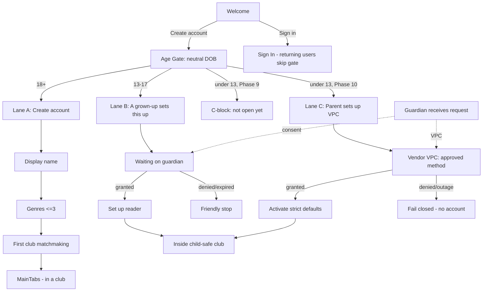

# Onboarding Flows — Flipbook

> Screen-by-screen specification for the redesigned, age-segmented onboarding. This is the design companion to `prd.md` § 6B (the requirements) and `product-roadmap.md` Phases 9–10 (the build plan). Build copy here in the Flipbook voice — warm-witty bookish, never cute, never alarming.
>
> **Phasing:** Lanes A (18+) and B (13–17) ship in **Phase 9** (before public launch). Lane C (under-13) is **blocked** in Phase 9 and turned on in **Phase 10** behind the verifiable-parental-consent vendor + legal sign-off.
>
> **Not legal advice** — counsel must review before public launch and again before under-13 enablement.

---

## 1. Principles

1. **Neutral first, always.** The age gate asks for a birthdate, never "are you over 18?" A non-neutral gate teaches people to lie.
2. **Adults stay frictionless.** An 18+ user should reach a joinable club in under two minutes. We *removed* a screen (real name) — we don't add net friction for grown-ups.
3. **Minors are provisioned, never self-served.** No under-18 creates their own account in the open app. A vetted adult places them into one specific club.
4. **Safety is structural, not cosmetic.** Minor-mode is enforced server-side (Convex). The UI only reflects state; it never *grants* it.
5. **Fail closed.** If consent isn't granted, no usable minor account exists. If a vendor is down, under-13 onboarding blocks — it never waves a child through.
6. **Calm copy.** Even the "you can't proceed" screens are warm. A blocked 12-year-old should feel invited to come back with a grown-up, not scolded.

---

## 2. Routing logic (the gate)

`RootNavigator` already branches on auth + profile state. Onboarding inserts an **age gate** ahead of account creation and a **lane router** after it.

```
App open
  └─ Not signed in ──────────────► AuthStack
                                     └─ Welcome
                                         ├─ "Create account" ─► AGE GATE ─► lane router
                                         └─ "Sign in" ───────► SignIn (returning users skip the gate)
  └─ Signed in, no users row ─────► OnboardingStack (lane determined by ageTier from the gate)
  └─ Signed in, has users row ────► MainTabs
```

**Lane router (after the neutral DOB gate computes `ageTier`):**

```
ageTier === "adult"   ─► Lane A: Adult onboarding
ageTier === "teen"    ─► Lane B: Guardian-provisioned (13–17)
ageTier === "under13" ─► Phase 9: Lane C-block (friendly "ask a grown-up")
                          Phase 10: Lane C: Under-13 VPC onboarding
```

The DOB result is persisted (device + server) so it can't be re-answered to age up (FR-042).

---

## 3. Shared entry — Welcome → Age Gate

### S0 · Welcome (existing, unchanged)
Wordmark, one line, two CTAs: **Create account** (primary), **Sign in** (secondary). Theme-aware (Light/Flip/Dark).

### S1 · Age Gate (new — all new users)
- **Purpose:** establish age tier before collecting anything else.
- **UI:** "When's your birthday?" with a native date picker (month / day / year). No "I'm over 18" shortcut. One **Continue** button, disabled until a full date is entered.
- **Microcopy under the field:** "We ask so we can set up the right, safe experience for you. We keep only your birth year."
- **On Continue:** compute `ageTier`; store `birthYear` + `ageTier` only (never the full DOB); persist anti-retry flag; route to the matching lane.
- **States:** *invalid* (future date / impossible date) → inline error "That date doesn't look right." *Anti-retry* (already answered on this device without finishing) → resume the prior lane, don't re-ask.

> **Design note:** the gate sits *before* account creation so we collect the minimum needed to route. Per the FTC's Feb 2026 policy posture, collecting age solely to gate is the intended pattern — but still minimize and don't retain the full DOB.

---

## 4. Lane A — Adult (18+) · Phase 9

The streamlined happy path. Three screens, then matchmaking.

### A1 · Create account
Apple / Google / phone OTP (Clerk, existing). On success → A2.

### A2 · Display name
- Single field, max 50 chars. "What should people call you?" Helper: "This is what your clubs will see."
- **No real first/last name** — the old `UserDetailsScreen` is removed from this flow (FR-043).
- Continue → A3.

### A3 · Genres (≤3)
- "Pick up to three things you love to read. We'll use them to find your first club." Chip multi-select; **Skip** allowed ("I'll decide later") with a note that suggestions will be weaker.
- Continue → A4.

### A4 · First club (matchmaking — the anti-empty-room screen)
This is the screen the current build is missing. A new adult should never land on an empty home.

Show, in priority order:
1. **The inviting club** — if they arrived via an invite link, the club they were invited to, with a big **Join** CTA.
2. **Suggested active clubs** — public clubs matching their genres, sorted by recent activity (live reactions first). Each card: cover, name, member count, "active 2h ago."
3. **Paste an invite** — a field for an invite code, for people who have one but didn't deep-link in.
4. **Start your own** — secondary CTA for organizers.

- **Empty state** (no public clubs yet, early days): "No public clubs reading right now. Start one — or paste an invite from a friend." Never a dead end.
- On Join/Create → `MainTabs`, landing inside the club.

**Outcome:** adult is in (or starting) a club, ~90s–2min. Magic moment is one reading session away.

---

## 5. Lane B — Teen (13–17) · Phase 9

Adult-provisioned walled garden. The teen can *start* the flow, but the account doesn't activate until a guardian consents.

### B1 · "A grown-up sets this up"
- Replaces the normal account-creation step. Warm framing: "Flipbook for readers under 18 is set up by a parent, guardian, or teacher. Let's loop yours in."
- Explain in one line what happens next: "We'll send them a quick note to OK your account and add you to your club."
- Field: **guardian's email** (and/or phone). Validate it's well-formed and **not the same** as any address the teen just used.
- Continue → creates a `pending` `parentalConsents` row (`purpose: "teen_onboarding"`), sends the guardian request, → B2.

### B2 · "Waiting on your grown-up"
- Holding screen: "We've sent a note to [guardian email]. Once they say yes, you're in." Show the guardian email with an **edit** option (wrong address) and a **resend** (one reminder, rate-limited).
- No usable account exists yet. If the teen closes the app, they resume here.
- **States:** *granted* → B3. *denied* → friendly stop: "Your grown-up didn't OK this for now. That's okay — check in with them and come back." *expired* (no response) → "We didn't hear back. Want to try a different email?"

### B3 · Set up your reader (post-consent, minimal)
- Only after `granted`. Display name (max 50) + optional genres. **No real name. No precise data.**
- Account activates with `isMinor: true`, `isDiscoverable: false`, `accountType: "minor"`, `ageTier: "teen"`, `guardianUserId`/`guardianContact`. Minor-mode rules now enforced server-side.
- → lands **inside the specific child-safe club** they were provisioned into. Never discovery.

> **Teens never see:** discovery feed, public clubs, "start a club," stranger profiles, or open audio. Their world is the club(s) their guardian placed them in.

---

## 6. Lane C — Under-13 · Phase 9 (blocked) → Phase 10 (VPC)

### Phase 9 — C-block (friendly stop)
- Screen: "Flipbook isn't open to readers under 13 just yet. We're building a safe space for younger readers with their grown-ups — hang tight." 
- **No account is created. No data retained** beyond the anti-retry flag.
- Optional: "Tell a grown-up to join the early list" → links to the adult/guardian waitlist (no child data collected).

### Phase 10 — Lane C (under-13 VPC)
Same shape as Lane B, but the guardian step is a **verifiable parental consent** flow run by the vendor (KWS / k-ID), not a simple email OK.

- **C1 · "A parent needs to set this up"** — collect guardian contact; create a `pending` `parentalConsents` row (`purpose: "under13_vpc"`).
- **C2 · Vendor VPC** — hand the guardian to the vendor's approved consent method (text-plus, face-match-to-ID, knowledge-based auth, or card). *Facial age estimation is NOT an approved VPC method — do not use it for consent.* The child cannot proceed until the vendor returns `granted`.
- **C3 · Activate (strictest defaults)** — on `granted`, create the under-13 account with the most restrictive minor-mode settings (`ageTier: "under13"`), inside the child-safe club. Record `method`, `vendor`, `vendorReference` — never raw ID documents.
- **Fail closed:** vendor outage or `denied` → no account, clear message, queue/notify. Never admit an under-13 without granted VPC.

---

## 7. Guardian side — the consent + management flow

The guardian is a first-class adult user (`accountType: "guardian"` — an adult account can also be a guardian).

1. **Receive request** — email/SMS: "[Teen's name] wants to join a reading club on Flipbook. You're listed as their grown-up. Review & decide." Deep link opens the consent screen (or vendor flow for under-13).
2. **Review** — what the child will access (this specific club, reading + reactions + supervised chat), what data is collected (display name only), and the privacy posture. Plain language.
3. **Decide** — **Allow** or **Decline**. Allow writes `granted`; the child activates. (Under-13: Allow is the vendor-verified VPC event.)
4. **Manage (ongoing, Phase 10)** — a guardian dashboard: list managed minors (`users.by_guardian`), see/limit their clubs, and **revoke** consent. Revoke deactivates the child account immediately and ends any session they're in; the consent record is kept as `revoked` for the audit window.

---

## 8. Invite-link routing (adult vs. minor) — the critical guard

Invite-link auto-join is the single most dangerous existing mechanism once minors exist. Routing **must** branch on account state:

- **Signed-in adult taps invite** → existing behavior: open join screen / auto-join (for adult clubs).
- **Signed-in minor taps invite** → **NEVER auto-join.** If it's their guardian-provisioned child-safe club, fine; otherwise show "This club isn't available for your account." No silent add, ever.
- **Logged-out tap → routes through Welcome → Age Gate.** If the gate says minor, the invite does **not** auto-join after signup — it routes into guardian provisioning (B1/C1). Only an adult result resumes the normal invite-join.
- **Adult-club invite that reaches a minor** → blocked with the friendly message above; optionally surface "ask your grown-up to set up a Flipbook kids' club."

---

## 9. Flow diagram



---

## 10. Build mapping

| Flow / screen | PRD | Roadmap task |
|---|---|---|
| Age gate + tier derivation + anti-retry | FR-042 | TASK-109 |
| Lane A (adult, no real name, matchmaking) | FR-043 | TASK-110 |
| Lane B (teen provisioning + consent) | FR-044 | TASK-111 |
| Minor-mode server-side enforcement | FR-045 | TASK-112 |
| Invite routing + under-13 block screen | FR-045 | TASK-113 |
| Child-safe club type + guardian verification | FR-046 | TASK-115 |
| Vendor VPC + under-13 lane (C) | FR-047 | TASK-116, TASK-117 |
| Guardian dashboard + revocation | FR-048 | TASK-118 |

---

## 11. Copy bank (Flipbook voice — adjust in build)

- **Age gate:** "When's your birthday?" / "We ask so we can set up the right, safe experience. We keep only your birth year."
- **Adult empty matchmaking:** "No public clubs reading right now. Start one — or paste an invite from a friend."
- **Teen setup intro:** "Flipbook for under-18 readers is set up with a parent, guardian, or teacher. Let's loop yours in."
- **Teen waiting:** "We've sent a note to your grown-up. Once they say yes, you're in."
- **Teen denied:** "Your grown-up didn't OK this for now. That's okay — check in with them and come back."
- **Under-13 block (Phase 9):** "Flipbook isn't open to readers under 13 just yet. We're building a safe space for younger readers with their grown-ups — hang tight."
- **Minor hits an adult invite:** "This club isn't available for your account."
- **Guardian request:** "[Name] wants to join a reading club on Flipbook. You're listed as their grown-up. Review & decide."
