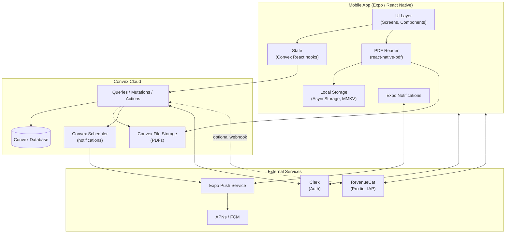

# PRD — Flipbook

## 1. Overview

### Product Summary

**Flipbook** is a social reading platform where book clubs read together in real time and creators turn audiences into communities. Readers create or join clubs in seconds (like creating a WhatsApp group), open books inside the app, and see other members' reactions and comments appear in the margins as they read — page-keyed and spoiler-free. Indie authors publish chapters into their own community surfaces, and subscribers receive live notifications when new chapters drop, gathering in real time around the release. MVP ships on iOS and Android via Expo (React Native), with a web companion and creator monetization deferred to Phase 2.

### Objective

This PRD specifies the MVP scope as defined in `docs/product-vision.md` § Product Strategy > MVP Definition. The MVP must be buildable in 6–8 weeks of focused part-time work using Claude Code. It implements the magic moment (live reactions during a creator chapter drop) and the supporting moments (in-club synchronized reactions, "caught up to the club" rush). Anything outside the MVP scope listed below is deferred to Phase 2 or later.

### Market Differentiation

The technical implementation must deliver on the central differentiation: **the conversation lives on the page, not in a feed.** Three things must be true at runtime: (1) reactions and comments are anchored to specific pages of specific books and rendered in the margin as a reader reaches them, (2) a reader's progress is reflected to other club members in real time without polling, (3) creator chapter drops trigger push notifications and open subscribers directly into the new chapter. If any of these breaks under load or feels laggy, the magic moment fails.

### Magic Moment

A reader follows an indie author on Flipbook. The author drops a new chapter. The reader opens it, reads it in-app, and on the last page sees other subscribers' reactions appearing live in the margins. They reply. The author replies back.

**Technical requirements for the magic moment to fire reliably:**

- **Push notification delivery within 30s of chapter publish.** Reliant on Expo Push Notifications + APNs/FCM.
- **Cold-start to chapter open in under 6s.** Tap notification → app opens → chapter renders.
- **Reaction roundtrip latency under 500ms.** From "drop reaction" tap to other readers seeing it in their margin. This is Convex's reactive query path.
- **In-app PDF reader handles 200–400 page documents without jank.** Page turns under 200ms.
- **Author reactions visually distinguished.** Author badge rendered next to author's reactions.

### Success Criteria

- All P0 functional requirements (FR-001 through FR-NN listed in § 6) implemented and manually verified.
- Time to magic moment (signup → first reaction in a club with active members) under 5 minutes for a happy-path new user.
- Cold-start app launch under 3 seconds on a mid-tier Android device (e.g., Pixel 5).
- Reaction roundtrip latency p95 under 500ms in dev environment.
- App passes App Store / Play Store review on first or second submission.
- All P0 features have at least manual smoke-test coverage; critical paths (auth, payment, upload, reactions) have automated tests.

-----

## 2. Technical Architecture

### Architecture Overview



The mobile app is the only client. Convex is the entire backend (functions, database, file storage, scheduling). Clerk handles authentication (with Convex integration for identity validation in functions). RevenueCat handles in-app purchases for the Pro tier. Expo's push service delivers notifications via APNs (iOS) and FCM (Android).

### Chosen Stack

| Layer | Choice | Rationale |
|---|---|---|
| Frontend | Expo (React Native) | Single codebase for iOS + Android, generous free tier (EAS builds), first-class libraries for offline storage, file handling (PDFs), and push notifications. Best mobile path for a solo designer-founder shipping with an AI coding agent. |
| Backend | Convex | Real-time reactivity is exactly what the live reactions in margins feature needs — no polling, no websocket plumbing. Zero backend boilerplate. Built-in file storage for PDF uploads. Generous free tier (1M function calls, 1GB storage). Best-in-class with Claude Code. |
| Database | Convex Database | Included with Convex backend, automatic indexing, ACID transactions, reactive queries for real-time progress and reactions. Document-relational model fits the social/reactive shape of Flipbook better than pure SQL. |
| Auth | Clerk | Drop-in auth with pre-built UI components for React Native — Apple Sign-In (required for App Store), Google, magic links, and phone OTP. 10,000 MAU free tier well exceeds the 90-day target. Polished, documented Convex + Clerk integration path. |
| Payments | RevenueCat | MVP scope: handles only the reader Pro tier via Apple/Google in-app billing — works globally, including Nigeria. Free up to $2.5k tracked monthly revenue. Creator monetization is Phase 2 (Polar / Stripe Connect). |

### Stack Integration Guide

**Setup order.** Do not deviate from this order — each step depends on the previous.

1. **Initialize Expo app.** `npx create-expo-app flipbook --template blank-typescript`. Select TypeScript template. Verify dev server runs in iOS Simulator and Android Emulator.
2. **Install Convex.** `npm install convex`. Run `npx convex dev` to initialize. This creates the `convex/` directory and prompts for project setup. Verify the Convex dashboard is reachable at `dashboard.convex.dev`.
3. **Install Clerk Expo.** `npm install @clerk/clerk-expo`. Wrap the app root in `<ClerkProvider>` with the publishable key from your Clerk dashboard. Clerk needs `expo-secure-store` for token storage.
4. **Configure Clerk + Convex integration.** In the Clerk dashboard, configure JWT templates with a "convex" template (instructions on convex.dev/docs/auth/clerk). Add the issuer URL to `convex/auth.config.ts`. Verify by querying an authenticated function from the app.
5. **Install design system fundamentals.** `npm install nativewind` (for Tailwind support — `nativewind` v4 is the current major). Configure `tailwind.config.ts` with the design tokens from `docs/product-vision.md` § Design Direction > Design Tokens.
6. **Install fonts.** `npx expo install expo-font @expo-google-fonts/raleway @expo-google-fonts/inter`. Load Raleway and Inter at app boot.
7. **Install navigation.** `npx expo install @react-navigation/native @react-navigation/native-stack @react-navigation/bottom-tabs react-native-screens react-native-safe-area-context`.
8. **Install PDF reader.** `npx expo install react-native-pdf react-native-blob-util`. Note: `react-native-pdf` requires native code, so you cannot use Expo Go for testing — must use `npx expo prebuild` and run on a development build.
9. **Install RevenueCat.** `npm install react-native-purchases`. Configure with App Store Connect / Google Play Console product IDs. Initialize with the public SDK key in `App.tsx`.
10. **Install push notifications.** `npx expo install expo-notifications expo-device expo-constants`. Register the device token with Convex on signup.

**Known integration gotchas.**

- **react-native-pdf and Expo Go are incompatible.** Must run on a development build via `npx expo prebuild` + `npx expo run:ios` / `npx expo run:android`. Document this in the README.
- **Clerk Expo requires `expo-secure-store`** as a peer dependency for token persistence.
- **Convex auth tokens refresh on a different cycle than Clerk.** Use the Clerk-Convex integration helper (`useConvexAuth()` from `@clerk/clerk-expo` + `convex/react-clerk`) — don't roll your own.
- **NativeWind v4 requires `babel.config.js` configuration.** Add `nativewind/babel` preset.
- **iOS push notifications require the Apple Developer Push Notifications capability.** Configure in `app.json` under `ios.entitlements`.
- **Convex file storage URLs are signed and expire.** When displaying an uploaded PDF, fetch a fresh URL via a query at the moment of read — don't cache URLs in app state for more than a minute.

**Required environment variables.**

```bash
# .env.local (committed as .env.example without values)
EXPO_PUBLIC_CLERK_PUBLISHABLE_KEY=pk_test_...
EXPO_PUBLIC_CONVEX_URL=https://...convex.cloud
EXPO_PUBLIC_REVENUECAT_API_KEY_IOS=...
EXPO_PUBLIC_REVENUECAT_API_KEY_ANDROID=...
```

Convex deploy keys are managed by `npx convex dev` / `npx convex deploy` — not stored in `.env`.

### Repository Structure

```
flipbook/
├── app.json                     # Expo config: name, scheme, icons, push perms
├── babel.config.js              # NativeWind preset
├── tailwind.config.ts           # Design tokens (from product-vision.md)
├── tsconfig.json
├── eas.json                     # EAS Build profiles (dev, preview, production)
├── package.json
├── App.tsx                      # Root: ClerkProvider, ConvexProvider, navigation
│
├── src/
│   ├── navigation/
│   │   ├── RootNavigator.tsx    # Auth gate + main navigator
│   │   ├── AuthStack.tsx        # Welcome, sign-in flows
│   │   └── MainTabs.tsx         # Bottom tabs: Community / Library / Profile
│   │
│   ├── screens/
│   │   ├── auth/
│   │   │   ├── WelcomeScreen.tsx
│   │   │   ├── SignInScreen.tsx
│   │   │   └── ProfileSetupScreen.tsx
│   │   ├── community/
│   │   │   ├── CommunityHomeScreen.tsx     # Discovery + my clubs
│   │   │   ├── CreateClubScreen.tsx
│   │   │   ├── ClubDetailScreen.tsx
│   │   │   └── InviteAcceptScreen.tsx
│   │   ├── library/
│   │   │   ├── LibraryScreen.tsx           # User's books across clubs
│   │   │   └── BookDetailScreen.tsx
│   │   ├── reader/
│   │   │   ├── ReaderScreen.tsx            # The PDF reader + reactions UI
│   │   │   └── ReactionComposer.tsx        # Long-press reaction modal
│   │   ├── profile/
│   │   │   ├── ProfileScreen.tsx
│   │   │   └── SettingsScreen.tsx
│   │   └── pro/
│   │       └── ProUpgradeScreen.tsx        # RevenueCat paywall
│   │
│   ├── components/
│   │   ├── ui/                  # Design system primitives
│   │   │   ├── Button.tsx       # Primary / Secondary / Alt + states
│   │   │   ├── Card.tsx
│   │   │   ├── Input.tsx
│   │   │   ├── Tag.tsx
│   │   │   ├── Avatar.tsx
│   │   │   ├── BottomSheet.tsx
│   │   │   └── Skeleton.tsx
│   │   └── features/
│   │       ├── ClubCard.tsx
│   │       ├── BookCover.tsx
│   │       ├── ReactionBubble.tsx
│   │       ├── MarginReactionsList.tsx
│   │       ├── ProgressVisualization.tsx
│   │       └── AuthorBadge.tsx
│   │
│   ├── theme/
│   │   ├── colors.ts            # Color tokens object
│   │   ├── typography.ts        # Type scale
│   │   ├── spacing.ts
│   │   └── index.ts             # Exports the consolidated theme
│   │
│   ├── lib/
│   │   ├── convex.ts            # Convex client setup
│   │   ├── clerk.ts             # Clerk config helpers
│   │   ├── revenuecat.ts        # RevenueCat init + entitlement checks
│   │   ├── notifications.ts     # Expo push registration + handlers
│   │   ├── pdf.ts               # PDF loading + caching helpers
│   │   ├── deeplinks.ts         # Branch / Expo Linking config for invite URLs
│   │   └── analytics.ts         # Optional: PostHog or similar
│   │
│   └── types/
│       ├── club.ts
│       ├── book.ts
│       ├── reaction.ts
│       └── user.ts
│
├── convex/
│   ├── schema.ts                # Database schema (all tables)
│   ├── auth.config.ts           # Clerk JWT config
│   ├── http.ts                  # HTTP routes (RevenueCat webhooks, Phase 2)
│   ├── crons.ts                 # Scheduled tasks
│   │
│   ├── users.ts                 # User CRUD + profile mutations
│   ├── clubs.ts                 # Club creation, listing, joining
│   ├── memberships.ts           # Club membership management
│   ├── books.ts                 # Book / PDF upload metadata
│   ├── chapters.ts              # Creator-published chapters
│   ├── reactions.ts             # Page-keyed reactions and comments
│   ├── progress.ts              # Reading progress tracking
│   ├── notifications.ts         # Push notification triggers
│   └── _generated/              # Auto-generated by Convex
│
├── assets/
│   ├── fonts/                   # Raleway, Inter ttf files
│   ├── images/
│   └── icons/
│
└── docs/
    ├── product-vision.md
    ├── prd.md (this file)
    └── product-roadmap.md
```

### Infrastructure & Deployment

- **Backend deployment:** Convex Cloud (free tier sufficient for first 6 months at MVP scale). Run `npx convex deploy` to push functions and schema. Convex auto-handles scaling and database migrations within the schema model.
- **Mobile app builds:** EAS Build (Expo Application Services). Free tier covers MVP needs (~30 builds/month). Configure in `eas.json` with `development`, `preview`, and `production` profiles.
- **App distribution:** TestFlight (iOS) and Google Play Internal Testing → Closed Testing → Production. Apple Developer Program ($99/year) and Google Play Developer ($25 one-time) are the only required external costs.
- **CI/CD recommendation:** GitHub Actions on push to main → trigger `eas build --auto-submit` for production builds. For development, run builds manually. Add CodeRabbit (free for public repos) for automated PR review per the phase workflow in `docs/product-roadmap.md`.

### Security Considerations

- **Authentication flow:** Clerk handles all authentication. JWTs are short-lived (1 hour) and refreshed automatically by the Clerk SDK. Convex validates JWTs on every authenticated function call against the Clerk JWKS endpoint configured in `auth.config.ts`.
- **Data protection at rest:** Convex encrypts data at rest by default. Uploaded PDFs are stored in Convex File Storage with signed URLs that expire after a configurable TTL (default 1 hour). PDF URLs must never be cached client-side beyond their expiry.
- **Data protection in transit:** All client-server traffic is over HTTPS/WSS. Convex uses TLS 1.2+ for all connections.
- **API security:** Every Convex query and mutation that accesses user data must call `ctx.auth.getUserIdentity()` and check that the requesting user has access to the resource. Public queries (e.g., listing public clubs) explicitly do NOT call auth — but they MUST filter to public-only data.
- **Input validation:** All mutation inputs are validated with Convex's `v.*` validators (Zod-like schema validation). Reject any input not matching the schema. Reject string inputs over reasonable max lengths (display name 50 chars, comment 200 chars, club description 500 chars).
- **PDF upload safety:** Reject any upload over 50MB. Reject any file whose MIME type is not `application/pdf`. Scan for malicious content is out of scope for MVP — flag this as a Phase 2 hardening item.
- **DMCA process:** Implement a takedown contact email (`dmca@flipbook.app`) and a documented removal flow. When a takedown is filed, the moderator who uploaded is notified, the file is removed from storage, and the upload metadata is marked `removed`.
- **Rate limiting:** Convex provides per-IP rate limiting at the platform level. Application-level rate limits (e.g., max 10 reactions per minute per user) are implemented in mutations as throttle checks.

### Cost Estimate

Monthly cost at MVP scale (< 1000 users) for the first 6 months:

| Service | Monthly cost | Notes |
|---|---|---|
| Convex (Free tier) | $0 | 1M function calls, 1GB storage, 0.5GB DB. Sufficient for first 6 months. |
| Clerk (Free tier) | $0 | 10,000 MAU free. Easily covers 90-day and 6-month targets. |
| Expo / EAS (Free tier) | $0 | 30 builds/month, all features needed for MVP. |
| RevenueCat (Free tier) | $0 | Free up to $2.5k tracked monthly revenue. |
| Apple Developer Program | $8.25 | $99/year amortized. |
| Google Play Console | $0.35 | $25 one-time amortized over 6 years. |
| Domain (`flipbook.app` or similar) | $1 | ~$12/year for a `.app` domain. |
| **Total** | **~$10/month** | Comfortably within the $15–30/month budget. |

**At scale (10k MAU, 6-month target):**

- Convex: likely ~$25–50/month (Pro tier when free tier exhausted)
- Clerk: still on free tier (10k MAU)
- Other services: same
- Total: ~$40–70/month — sustainable from $50k MRR

-----

## 3. Data Model

### Entity Definitions

All entities live in Convex and use Convex's `v.*` validators. The schema is the source of truth — implement in `convex/schema.ts`.

```typescript
// convex/schema.ts
import { defineSchema, defineTable } from "convex/server";
import { v } from "convex/values";

export default defineSchema({
  users: defineTable({
    clerkId: v.string(),                 // Stable Clerk user ID
    displayName: v.string(),             // Required, max 50 chars — the public-facing handle
    firstName: v.string(),               // From Figma onboarding step "User details"
    lastName: v.string(),                // From Figma onboarding step "User details"
    avatarUrl: v.optional(v.string()),   // Storage URL or external (Clerk, social)
    bio: v.optional(v.string()),         // Max 200 chars
    genres: v.array(v.string()),         // From onboarding; predefined enum list
    pushToken: v.optional(v.string()),   // Expo push token; updated on app launch
    proSubscriptionStatus: v.union(
      v.literal("free"),
      v.literal("active"),
      v.literal("expired"),
    ),
    proExpiresAt: v.optional(v.number()),  // Unix ms; from RevenueCat
    createdAt: v.number(),                 // Unix ms
    lastActiveAt: v.number(),
  })
    .index("by_clerk_id", ["clerkId"])
    .index("by_last_active", ["lastActiveAt"]),

  clubs: defineTable({
    name: v.string(),                    // Required, max 60 chars
    description: v.optional(v.string()), // Max 500 chars
    type: v.union(
      v.literal("standard"),             // Reader-created club
      v.literal("creator"),               // Creator publishing club
    ),
    visibility: v.union(
      v.literal("private"),              // Invite-only (default)
      v.literal("public"),                // Discoverable; future-state
    ),
    moderatorId: v.id("users"),          // Creator of the club
    coverImageUrl: v.optional(v.string()),  // "Community emblem" from Figma create flow
    permissions: v.object({              // From Figma "Create a new community" permissions checkboxes
      membersCanUploadBooks: v.boolean(),
      membersCanInviteOthers: v.boolean(),
      membersCanUpdateInfo: v.boolean(),
      // Phase 8 (Live Review Sessions). Optional so existing club docs remain
      // valid without a migration; treat `undefined` as `false`. When true,
      // any member may schedule and host a live session in this club.
      membersCanHostSessions: v.optional(v.boolean()),
    }),
    bookId: v.optional(v.id("books")),   // Currently-reading book; null for creator clubs that drop chapters
    inviteCode: v.string(),              // Unique short code for invite URLs
    memberCount: v.number(),             // Denormalized for fast list rendering
    createdAt: v.number(),
    lastActivityAt: v.number(),          // Updated on any reaction or progress event
  })
    .index("by_moderator", ["moderatorId"])
    .index("by_invite_code", ["inviteCode"])
    .index("by_visibility_activity", ["visibility", "lastActivityAt"])
    .index("by_type_activity", ["type", "lastActivityAt"]),

  memberships: defineTable({
    clubId: v.id("clubs"),
    userId: v.id("users"),
    role: v.union(
      v.literal("moderator"),
      v.literal("member"),
    ),
    joinedAt: v.number(),
    lastReadAt: v.optional(v.number()),
    isFollowing: v.boolean(),            // For creator clubs (subscriber semantics)
  })
    .index("by_club", ["clubId"])
    .index("by_user", ["userId"])
    .index("by_club_and_user", ["clubId", "userId"]),

  books: defineTable({
    title: v.string(),                   // Required, max 200 chars
    author: v.string(),                  // Required, max 100 chars
    pdfStorageId: v.id("_storage"),      // Convex File Storage ID
    pdfPageCount: v.number(),
    coverImageUrl: v.optional(v.string()),
    uploadedByUserId: v.id("users"),
    clubId: v.id("clubs"),               // Books are scoped to a club (private)
    isPublic: v.boolean(),               // Always false for MVP (private uploads only)
    isRemoved: v.boolean(),              // True if DMCA-removed
    fileSize: v.number(),                // Bytes
    createdAt: v.number(),
  })
    .index("by_club", ["clubId"])
    .index("by_uploader", ["uploadedByUserId"]),

  chapters: defineTable({
    clubId: v.id("clubs"),               // Always a creator-type club
    title: v.string(),                   // E.g. "Chapter 4: The Long Goodbye"
    chapterNumber: v.number(),           // Sequential within the club
    pdfStorageId: v.id("_storage"),      // The chapter PDF
    pdfPageCount: v.number(),
    publishedAt: v.number(),
    publishedByUserId: v.id("users"),    // The author (always the moderator)
    authorNote: v.optional(v.string()),  // Optional note shown above chapter
  })
    .index("by_club", ["clubId"])
    .index("by_club_and_number", ["clubId", "chapterNumber"]),

  reactions: defineTable({
    clubId: v.id("clubs"),
    bookId: v.optional(v.id("books")),
    chapterId: v.optional(v.id("chapters")),  // Either bookId or chapterId set
    page: v.number(),                    // 1-indexed page number
    paragraphIndex: v.optional(v.number()),  // 0-indexed within page; nullable
    userId: v.id("users"),
    type: v.union(
      v.literal("emoji"),
      v.literal("comment"),
    ),
    emoji: v.optional(v.string()),       // From curated set; required if type=emoji
    text: v.optional(v.string()),        // Required if type=comment, max 200 chars
    parentReactionId: v.optional(v.id("reactions")),  // For replies (1-level only)
    createdAt: v.number(),
  })
    .index("by_club", ["clubId"])
    .index("by_book_and_page", ["bookId", "page"])
    .index("by_chapter_and_page", ["chapterId", "page"])
    .index("by_user", ["userId"])
    .index("by_parent", ["parentReactionId"]),

  progress: defineTable({
    userId: v.id("users"),
    clubId: v.id("clubs"),
    bookId: v.optional(v.id("books")),
    chapterId: v.optional(v.id("chapters")),
    currentPage: v.number(),
    totalPages: v.number(),
    finishedAt: v.optional(v.number()),  // Set when currentPage === totalPages
    updatedAt: v.number(),
  })
    .index("by_user_and_club", ["userId", "clubId"])
    .index("by_book", ["bookId"])
    .index("by_chapter", ["chapterId"]),

  notifications: defineTable({
    userId: v.id("users"),
    type: v.union(
      v.literal("chapter_drop"),
      v.literal("reaction_reply"),
      v.literal("club_invite"),
      v.literal("milestone"),
      v.literal("session_scheduled"),    // Phase 8 — a session was scheduled in a club you're in
      v.literal("session_starting"),     // Phase 8 — a session you're attending / in its club is going live
    ),
    title: v.string(),
    body: v.string(),
    deepLink: v.string(),                // E.g. "flipbook://clubs/abc123/chapters/4"
    isRead: v.boolean(),
    sentAt: v.number(),
    relatedId: v.optional(v.string()),   // Generic ID for the entity (chapter, reaction, session)
  })
    .index("by_user_and_sent", ["userId", "sentAt"])
    .index("by_user_unread", ["userId", "isRead"]),

  // ---- Phase 8: Live Review Sessions (fast-follow after MVP launch) ----
  // Twitter Spaces–style live audio rooms scoped to a club, with a
  // synchronized live text chat. Audio media is carried by a WebRTC provider
  // (LiveKit Cloud — see § Dependencies); Convex owns scheduling, lifecycle,
  // presence, roles, and the text chat. The LiveKit "room" name is the
  // session's Convex _id, so the two systems stay in lockstep.
  liveSessions: defineTable({
    clubId: v.id("clubs"),
    title: v.string(),                   // Required, max 80 chars — "Chapter 1–5 deep dive"
    description: v.optional(v.string()), // Max 280 chars
    hostId: v.id("users"),               // Who created/hosts it (moderator or permitted member)
    // Optional anchor to what's being reviewed, for deep-linking + context.
    bookId: v.optional(v.id("books")),
    chapterId: v.optional(v.id("chapters")),
    status: v.union(
      v.literal("scheduled"),            // Created with a future scheduledFor
      v.literal("live"),                 // Host has started it; audio room is open
      v.literal("ended"),                // Host ended it (or it auto-ended)
      v.literal("cancelled"),            // Host cancelled before going live
    ),
    scheduledFor: v.number(),            // Unix ms — when it's set to start
    startedAt: v.optional(v.number()),   // Set when status → live
    endedAt: v.optional(v.number()),     // Set when status → ended/cancelled
    // Denormalized peak + current counts for list rendering without a join.
    participantCount: v.number(),        // Currently-present participants
    peakParticipantCount: v.number(),
    // LiveKit room name == this session's _id (set at creation via a patch).
    createdAt: v.number(),
  })
    .index("by_club", ["clubId"])
    .index("by_club_and_status", ["clubId", "status"])
    .index("by_status_and_scheduled", ["status", "scheduledFor"])
    .index("by_host", ["hostId"]),

  sessionParticipants: defineTable({
    sessionId: v.id("liveSessions"),
    userId: v.id("users"),
    role: v.union(
      v.literal("host"),                 // Started it; full controls
      v.literal("speaker"),              // Granted mic by host
      v.literal("listener"),             // Default on join
    ),
    // Raise-hand request to speak. Cleared when promoted or denied.
    handRaised: v.boolean(),
    // Mute state is mirrored from the audio layer for UI; source of truth for
    // actual audio publish is LiveKit, this is for fast reactive rendering.
    isMuted: v.boolean(),
    joinedAt: v.number(),
    leftAt: v.optional(v.number()),      // Set on leave; row kept for history
    isPresent: v.boolean(),              // false after leftAt; drives live roster
  })
    .index("by_session", ["sessionId"])
    .index("by_session_and_user", ["sessionId", "userId"])
    .index("by_session_present", ["sessionId", "isPresent"])
    .index("by_user", ["userId"]),

  sessionMessages: defineTable({
    sessionId: v.id("liveSessions"),
    userId: v.id("users"),
    type: v.union(
      v.literal("comment"),              // Live text chat message
      v.literal("emoji"),                // Reaction stream (curated set, like reactions)
    ),
    text: v.optional(v.string()),        // Required if type=comment, max 280 chars
    emoji: v.optional(v.string()),       // Required if type=emoji
    createdAt: v.number(),
  })
    .index("by_session_and_created", ["sessionId", "createdAt"])
    .index("by_user_and_created", ["userId", "createdAt"]),   // Rate-limit lookup
});
```

### Relationships

- **`users` 1:N `memberships`** — A user can be a member of many clubs.
- **`clubs` 1:N `memberships`** — A club has many members.
- **`users` ↔ `clubs`** (many-to-many through `memberships`) — Junction table for club membership with role and follow state.
- **`clubs` 1:1 `users` (moderator)** — Each club has exactly one moderator (`moderatorId`).
- **`clubs` 1:N `books`** — A club can have multiple books over time (though typically one active at a time). Books are private to a club.
- **`clubs` 1:N `chapters`** — Creator-type clubs publish chapters; standard clubs do not.
- **`books`/`chapters` 1:N `reactions`** — Reactions belong to a specific page of a specific book or chapter.
- **`reactions` 1:N `reactions`** (self-referential via `parentReactionId`) — Reactions can have replies; only 1 level of nesting.
- **`users` 1:N `progress`** — A user has progress per (club, book/chapter).
- **`users` 1:N `notifications`** — Notifications belong to a specific user.
- **`clubs` 1:N `liveSessions`** (Phase 8) — A club can hold many live sessions over time; at most one `live` at a time (enforced in the start mutation).
- **`liveSessions` 1:N `sessionParticipants`** (Phase 8) — A session has many participants, each with a role (host/speaker/listener) and presence state.
- **`liveSessions` 1:N `sessionMessages`** (Phase 8) — A session has many live-chat messages and emoji reactions.
- **`liveSessions` 0:1 `books`/`chapters`** (Phase 8) — A session may optionally be anchored to the book or chapter under review.

**Cascade behavior.** Convex doesn't have foreign-key cascades — implement manually. When a club is deleted: delete memberships, books (and storage), chapters (and storage), reactions, progress entries, live sessions (and their participants + messages), for that club. When a user is deleted: anonymize their reactions and session messages (set `userId` to a "deleted" sentinel), remove their memberships and session-participant rows, delete their progress, delete their notifications. When a live session ends: keep the row (status `ended`) and its messages for history; mark all participants `isPresent: false`.

### Indexes

The indexes defined inline in the schema above cover all common query patterns:

- `users.by_clerk_id` — login flow lookup
- `users.by_last_active` — recently active discovery
- `clubs.by_invite_code` — invite link join flow
- `clubs.by_visibility_activity` — public discovery feed
- `clubs.by_type_activity` — discovery by club type
- `memberships.by_club_and_user` — quick "is user a member" check
- `memberships.by_user` — list a user's clubs
- `reactions.by_book_and_page` / `by_chapter_and_page` — load reactions for a page (the hot path)
- `reactions.by_parent` — load replies to a reaction
- `progress.by_user_and_club` — show user's progress in a club
- `notifications.by_user_unread` — unread notification count
- `chapters.by_club_and_number` — list chapters in order
- `liveSessions.by_club_and_status` (Phase 8) — show a club's live/scheduled sessions
- `liveSessions.by_status_and_scheduled` (Phase 8) — upcoming-session reminders (cron) + "live now" surfacing
- `sessionParticipants.by_session_present` (Phase 8) — render the live roster (speakers + listeners)
- `sessionMessages.by_session_and_created` (Phase 8) — load the live chat in order

-----

## 4. API Specification

### API Design Philosophy

Convex is RPC-style — functions are queries (read-only, reactive), mutations (writes), or actions (side effects, e.g., calling external services). Functions are organized by domain (file per entity area).

**Authentication.** All functions that access user data must call `await ctx.auth.getUserIdentity()` and resolve the Convex user record via the `clerkId`. Helper: `getCurrentUser(ctx)` (defined in `convex/users.ts`). If unauthenticated where authentication is required, throw `ConvexError("Unauthorized")`.

**Error handling.** Throw `ConvexError` with structured payloads: `throw new ConvexError({ code: "not_found", message: "Club not found" })`. Clients pattern-match on `error.data.code`.

**Pagination.** Convex provides `paginate()` on indexes. Use cursor-based pagination for any list that may exceed 50 items. Default page size: 20.

### Endpoints

#### Users (`convex/users.ts`)

```typescript
// Get current user's profile (returns null if not signed up yet)
query("users.me", {
  args: {},
  returns: v.union(v.null(), userObject),
});

// Initial profile setup (called after signup completes)
mutation("users.create", {
  args: {
    displayName: v.string(),
    avatarUrl: v.optional(v.string()),
    genres: v.array(v.string()),
  },
  returns: v.id("users"),
});

// Update profile
mutation("users.update", {
  args: {
    displayName: v.optional(v.string()),
    avatarUrl: v.optional(v.string()),
    bio: v.optional(v.string()),
    genres: v.optional(v.array(v.string())),
  },
  returns: v.null(),
});

// Update push token (called on app boot)
mutation("users.updatePushToken", {
  args: { token: v.string() },
  returns: v.null(),
});

// Sync RevenueCat status (called from app after entitlement check)
mutation("users.syncProStatus", {
  args: {
    status: v.union(v.literal("free"), v.literal("active"), v.literal("expired")),
    expiresAt: v.optional(v.number()),
  },
  returns: v.null(),
});
```

#### Clubs (`convex/clubs.ts`)

```typescript
// List the current user's clubs
query("clubs.listMine", {
  args: {},
  returns: v.array(clubWithMembershipObject),
});

// List public clubs for discovery
query("clubs.listPublic", {
  args: {
    cursor: v.optional(v.string()),
    genreFilter: v.optional(v.array(v.string())),
  },
  returns: v.object({
    page: v.array(clubObject),
    cursor: v.union(v.null(), v.string()),
  }),
});

// Get a single club by ID (must be member or club must be public)
query("clubs.get", {
  args: { clubId: v.id("clubs") },
  returns: v.union(v.null(), clubDetailObject),
});

// Get a club by invite code (used in invite-link flow)
query("clubs.getByInviteCode", {
  args: { inviteCode: v.string() },
  returns: v.union(v.null(), clubObject),
});

// Create a new club
mutation("clubs.create", {
  args: {
    name: v.string(),
    description: v.optional(v.string()),
    type: v.union(v.literal("standard"), v.literal("creator")),
    visibility: v.union(v.literal("private"), v.literal("public")),
  },
  returns: v.object({
    clubId: v.id("clubs"),
    inviteCode: v.string(),
  }),
});

// Update a club (moderator only)
mutation("clubs.update", {
  args: {
    clubId: v.id("clubs"),
    name: v.optional(v.string()),
    description: v.optional(v.string()),
    coverImageUrl: v.optional(v.string()),
  },
  returns: v.null(),
});

// Delete a club (moderator only). Cascades deletes per Data Model.
mutation("clubs.delete", {
  args: { clubId: v.id("clubs") },
  returns: v.null(),
});
```

#### Memberships (`convex/memberships.ts`)

```typescript
// Join a club via invite code (the link-tap flow)
mutation("memberships.joinByCode", {
  args: { inviteCode: v.string() },
  returns: v.id("clubs"),
});

// Leave a club
mutation("memberships.leave", {
  args: { clubId: v.id("clubs") },
  returns: v.null(),
});

// List members of a club (must be member to see)
query("memberships.listClubMembers", {
  args: { clubId: v.id("clubs") },
  returns: v.array(memberWithProgressObject),
});

// Follow a creator club
mutation("memberships.follow", {
  args: { clubId: v.id("clubs") },
  returns: v.null(),
});

// Unfollow a creator club
mutation("memberships.unfollow", {
  args: { clubId: v.id("clubs") },
  returns: v.null(),
});
```

#### Books (`convex/books.ts`)

```typescript
// Generate a Convex File Storage upload URL (called by client to upload PDF)
mutation("books.generateUploadUrl", {
  args: {},
  returns: v.string(),
});

// Register an uploaded PDF as a book
mutation("books.register", {
  args: {
    clubId: v.id("clubs"),
    title: v.string(),
    author: v.string(),
    pdfStorageId: v.id("_storage"),
    coverImageUrl: v.optional(v.string()),
    pdfPageCount: v.number(),
    fileSize: v.number(),
  },
  returns: v.id("books"),
});

// Get a book and a fresh storage URL for the PDF
query("books.get", {
  args: { bookId: v.id("books") },
  returns: v.union(v.null(), v.object({
    book: bookObject,
    pdfUrl: v.string(),
  })),
});

// Mark a book as removed (DMCA flow; admin-only later)
mutation("books.markRemoved", {
  args: { bookId: v.id("books"), reason: v.string() },
  returns: v.null(),
});
```

#### Chapters (`convex/chapters.ts`)

```typescript
// Publish a new chapter to a creator club (moderator only)
mutation("chapters.publish", {
  args: {
    clubId: v.id("clubs"),
    title: v.string(),
    pdfStorageId: v.id("_storage"),
    pdfPageCount: v.number(),
    authorNote: v.optional(v.string()),
  },
  returns: v.id("chapters"),
  // Side effect: schedules push notifications to all subscribers via notifications.ts
});

// List chapters for a creator club
query("chapters.list", {
  args: { clubId: v.id("clubs") },
  returns: v.array(chapterObject),
});

// Get a chapter with a fresh storage URL
query("chapters.get", {
  args: { chapterId: v.id("chapters") },
  returns: v.union(v.null(), v.object({
    chapter: chapterObject,
    pdfUrl: v.string(),
  })),
});
```

#### Reactions (`convex/reactions.ts`)

```typescript
// Create a reaction (emoji or comment) on a page
mutation("reactions.create", {
  args: {
    clubId: v.id("clubs"),
    bookId: v.optional(v.id("books")),
    chapterId: v.optional(v.id("chapters")),
    page: v.number(),
    paragraphIndex: v.optional(v.number()),
    type: v.union(v.literal("emoji"), v.literal("comment")),
    emoji: v.optional(v.string()),
    text: v.optional(v.string()),
    parentReactionId: v.optional(v.id("reactions")),
  },
  returns: v.id("reactions"),
});

// List reactions for a page (the hot path — used by reader)
query("reactions.listForPage", {
  args: {
    bookId: v.optional(v.id("books")),
    chapterId: v.optional(v.id("chapters")),
    page: v.number(),
  },
  returns: v.array(reactionWithUserObject),
});

// List reactions across an entire book/chapter (for "caught up to club" view)
query("reactions.listAll", {
  args: {
    bookId: v.optional(v.id("books")),
    chapterId: v.optional(v.id("chapters")),
    upToPage: v.optional(v.number()),
  },
  returns: v.array(reactionWithUserObject),
});

// Delete own reaction
mutation("reactions.delete", {
  args: { reactionId: v.id("reactions") },
  returns: v.null(),
});
```

#### Progress (`convex/progress.ts`)

```typescript
// Update reading progress
mutation("progress.update", {
  args: {
    clubId: v.id("clubs"),
    bookId: v.optional(v.id("books")),
    chapterId: v.optional(v.id("chapters")),
    currentPage: v.number(),
    totalPages: v.number(),
  },
  returns: v.null(),
  // Side effect: updates club.lastActivityAt; checks for milestone (book finished)
});

// Get current user's progress for a club
query("progress.getMine", {
  args: { clubId: v.id("clubs") },
  returns: v.union(v.null(), progressObject),
});

// Get all members' progress in a club (for the progress visualization)
query("progress.listForClub", {
  args: { clubId: v.id("clubs") },
  returns: v.array(progressWithUserObject),
});
```

#### Notifications (`convex/notifications.ts`)

```typescript
// List user's notifications
query("notifications.list", {
  args: {
    cursor: v.optional(v.string()),
    onlyUnread: v.optional(v.boolean()),
  },
  returns: v.object({
    page: v.array(notificationObject),
    cursor: v.union(v.null(), v.string()),
  }),
});

// Mark a notification as read
mutation("notifications.markRead", {
  args: { notificationId: v.id("notifications") },
  returns: v.null(),
});

// Mark all as read
mutation("notifications.markAllRead", {
  args: {},
  returns: v.null(),
});

// Internal: send a push notification (called by other functions, not from client)
internalAction("notifications.sendPush", {
  args: {
    userId: v.id("users"),
    title: v.string(),
    body: v.string(),
    deepLink: v.string(),
    type: notificationTypeUnion,
    relatedId: v.optional(v.string()),
  },
});
```

-----

## 5. User Stories

### Epic: Authentication & Onboarding

**US-001: First-time signup**
As Maya, I want to sign up in under 90 seconds so I can start using Flipbook without friction.

Acceptance Criteria:
- [ ] Given I'm a new user opening Flipbook for the first time, when I tap "Get started", then I see Apple Sign-In, Google, and "Continue with phone" options.
- [ ] Given I tap any signup option, when authentication completes, then I'm shown the profile setup screen.
- [ ] Given I'm on the profile setup screen, when I enter a display name and pick at least 3 genres, then I'm able to tap "Continue" and land on the home screen.
- [ ] Edge case: signup is interrupted by app close → on next open, I resume at the profile setup screen, not back to "Get started."

**US-002: Existing user sign-in**
As a returning user, I want to be signed in automatically when I open the app, so I don't have to re-authenticate every session.

Acceptance Criteria:
- [ ] Given I previously signed in, when I open the app, then I'm taken directly to the home screen without seeing the signup flow.
- [ ] Given my Clerk session has expired, when I open the app, then it silently refreshes the token and I land on the home screen — no re-auth UI shown unless the refresh fails.

### Epic: Clubs & Communities

**US-003: Create a club**
As Maya, I want to create a club and share an invite link in under 60 seconds so my friends can join with one tap.

Acceptance Criteria:
- [ ] Given I'm on the home screen, when I tap "Create a club", then I see a form for club name (required), description (optional), and type ("Read together" or "Publish chapters").
- [ ] Given I've entered a name and tapped "Create", then the club is created and I'm shown a share sheet with an invite link (e.g., `https://flipbook.app/join/AB12CD`).
- [ ] Given I dismiss the share sheet, when I land on the club detail view, then I see myself as the moderator with a member count of 1.

**US-004: Join via invite link**
As a friend invited by Maya, I want to join Maya's club in one tap from her message.

Acceptance Criteria:
- [ ] Given I receive a Flipbook invite link in a chat app, when I tap it, then either (a) Flipbook opens and I'm shown the join screen if signed in, or (b) the App Store opens if I don't have the app, and after install + signup, I'm deep-linked back to the join screen.
- [ ] Given I'm on the join screen for a club, when I tap "Join", then I'm added to the club and shown the club detail view.
- [ ] Edge case: I tap the link while already a member → I'm taken directly to the club detail view, no duplicate-join error.

### Epic: Books & Reading

**US-005: Upload a book to a club (moderator)**
As Maya the moderator, I want to upload a PDF for my club to read together.

Acceptance Criteria:
- [ ] Given I'm a moderator viewing my club's detail screen, when I tap "Add a book", then I see options to pick a PDF from my device.
- [ ] Given I select a PDF under 50MB, when the upload completes, then I'm prompted to enter title and author, and the book becomes the active read for the club.
- [ ] Edge case: file is over 50MB → upload is rejected with a clear error message.
- [ ] Edge case: upload is interrupted (network drops) → the upload is cancelled cleanly, no half-uploaded book record.

**US-006: Read a book in-app**
As Maya, I want to open a book in Flipbook and read it without leaving the app.

Acceptance Criteria:
- [ ] Given I'm in a club with an active book, when I tap "Read", then the in-app PDF reader opens to my current page (or page 1 if I've never opened this book).
- [ ] Given I'm reading a book, when I scroll to the next page, then my progress updates without visible delay.
- [ ] Given I close the app while reading, when I reopen and tap "Read", then I land on the page I was last on.
- [ ] Given I have no internet connection, when I tap "Read" on a book I've previously opened, then it loads from device cache and I can read offline.

### Epic: Reactions & Conversation

**US-007: Drop a reaction on a page**
As Maya, I want to drop a quick emoji reaction on a paragraph that hit me.

Acceptance Criteria:
- [ ] Given I'm reading a page in the in-app reader, when I long-press a paragraph (or page if paragraph detection isn't available), then a reaction picker appears with 6 curated emojis and a "Comment" option.
- [ ] Given I tap an emoji, then the reaction is saved and visible in the margin within 500ms.
- [ ] Given I tap "Comment", then a small text input appears (max 200 chars) — on submit, the comment renders in the margin.

**US-008: See others' reactions in real time**
As Maya, I want to see other club members' reactions appear in the margin as they happen, while I'm reading.

Acceptance Criteria:
- [ ] Given I'm reading a page, when another club member drops a reaction on the same page, then the reaction appears in the margin within 1 second.
- [ ] Given a reaction appears, when I tap it, then I see a small bottom sheet with the reactor's name, the timestamp, and any comment text.
- [ ] Edge case: I scroll past the page where a new reaction was dropped → the reaction is preserved and visible when I scroll back.

**US-009: Reply to a reaction**
As Maya, I want to reply to a reaction that resonated, so I can have a small back-and-forth.

Acceptance Criteria:
- [ ] Given I'm viewing a reaction in the bottom sheet, when I tap "Reply", then a text input appears (max 200 chars).
- [ ] Given I submit a reply, then it appears nested under the original reaction.
- [ ] Replies are flat (1 level) — replies to replies are not supported.

### Epic: Creator Publishing

**US-010: Publish a chapter (creator)**
As an indie author, I want to publish a new chapter to my followers in under 90 seconds.

Acceptance Criteria:
- [ ] Given I'm a moderator of a creator-type club, when I tap "Publish chapter", then I'm prompted to enter title, upload a PDF, and add an optional author note.
- [ ] Given I tap "Publish", then the chapter is saved, the chapter number is auto-incremented, and a push notification is dispatched to all subscribers.
- [ ] Given my subscribers are online, when they receive the notification and tap it, then the app opens directly to the new chapter.

**US-011: Receive a chapter drop (subscriber)**
As Maya following an indie author, I want to be notified the moment they drop a new chapter, and to land directly in the new chapter when I open the notification.

Acceptance Criteria:
- [ ] Given I'm following a creator club, when the author publishes a new chapter, then I receive a push notification within 30 seconds.
- [ ] Given I tap the notification, when the app opens, then it deep-links directly to the new chapter (skipping any home screen).
- [ ] Edge case: I tap the notification while not signed in (rare) → I'm taken to the signup flow first, then deep-linked to the chapter after signup.

### Epic: Discovery

**US-012: Browse public clubs**
As Maya looking for my next read, I want to browse public clubs to find one that matches my interests.

Acceptance Criteria:
- [ ] Given I'm on the Community tab, when I tap "Discover", then I see a list of public clubs sorted by recent activity.
- [ ] Given I tap a club, then I see the club detail view with its book, members, and recent reactions (with reactions blurred until I join — preventing spoilers).
- [ ] Given I tap "Join", then I'm added to the club.

### Epic: Pro Tier

**US-013: Upgrade to Pro**
As a Maya who's joined three clubs and wants to join a fourth, I want to upgrade to Pro to unlock unlimited memberships.

Acceptance Criteria:
- [ ] Given I'm a free user trying to join a 4th club, when I tap "Join", then I see a Pro upgrade screen explaining the limit and the benefits.
- [ ] Given I tap "Upgrade", then I see the native iOS / Android purchase flow via RevenueCat.
- [ ] Given I complete purchase, then my Pro status is updated within 5 seconds and I can join the 4th club.
- [ ] Edge case: purchase fails → clear error message, my Pro status is unchanged, no charge.

-----

## 6. Functional Requirements

### Authentication & User Management

**FR-001: Clerk authentication integration**
Priority: P0
Description: Integrate Clerk for sign-up and sign-in with Apple Sign-In, Google, and phone OTP. Tokens stored via `expo-secure-store`. Auto-refresh on expiry.
Acceptance Criteria:
- App boot validates the existing session if present.
- All three auth methods successfully complete signup and sign-in.
- Sign-out clears all session data.
Related Stories: US-001, US-002

**FR-002: Convex user record creation**
Priority: P0
Description: After Clerk signup completes, create a `users` table record with Clerk ID, display name, avatar, genres, and default Pro status of "free".
Acceptance Criteria:
- A new `users` row exists for every signed-up Clerk user.
- The `clerkId` is the immutable link between Clerk and Convex.
- The user record cannot be created without a display name.
Related Stories: US-001

**FR-003: Profile setup screen**
Priority: P0
Description: A post-signup screen where the user enters display name, optional avatar, and selects ≥3 genres from a predefined list.
Acceptance Criteria:
- "Continue" button is disabled until display name has 1+ chars and 3+ genres are selected.
- Genre list contains at least: Fiction, Nonfiction, Sci-Fi/Fantasy, Romance, Mystery/Thriller, Memoir, History, Self-Help, Poetry, YA.
Related Stories: US-001

### Club Management

**FR-004: Club creation**
Priority: P0
Description: Authenticated users can create clubs with name, description, type (standard or creator), and visibility (private only in MVP).
Acceptance Criteria:
- Name is required, 1–60 chars.
- Description is optional, max 500 chars.
- Invite code is auto-generated as a 6-char base32 string.
- Creator is recorded as `moderatorId` and added as a `memberships` row with role `moderator`.
Related Stories: US-003

**FR-005: Invite link generation and sharing**
Priority: P0
Description: After club creation (and on demand from the club detail screen), generate a deep link of the form `https://flipbook.app/join/{inviteCode}` and present a native share sheet.
Acceptance Criteria:
- Tapping share opens the OS share sheet with the link pre-filled.
- The link works in Messages, WhatsApp, email, and any other share-sheet target.

**FR-006: Join by invite code**
Priority: P0
Description: Tapping an invite link, after auth, adds the user to the club and navigates to the club detail screen.
Acceptance Criteria:
- A user already in the club is taken directly to the club detail (no duplicate join).
- A nonexistent or expired invite code shows a friendly error: "This invite isn't working — ask the moderator to send a new one."
Related Stories: US-004

**FR-007: Club detail screen**
Priority: P0
Description: Shows club name, description, current book/chapter, members with progress, recent reactions (last 10), and an entry to start reading.
Acceptance Criteria:
- Members list shows up to 10 members + "View all" link if more exist.
- Reactions section shows last 10 reactions across the club, in reverse chronological order.
- "Start reading" button navigates to the reader screen.

**FR-008: Leave a club**
Priority: P0
Description: A non-moderator member can leave a club. The moderator cannot leave their own club without deleting it or transferring moderation (transfer is Phase 2 — for MVP, the moderator can only delete).
Acceptance Criteria:
- Confirmation dialog before leaving.
- Member is removed from `memberships`; their progress is preserved.

**FR-009: Delete a club (moderator only)**
Priority: P1
Description: A moderator can delete their club. Cascades: deletes all memberships, books (and storage), chapters, reactions, progress for the club.
Acceptance Criteria:
- Confirmation dialog with explicit warning.
- All cascade deletes complete or none do (transactional).

### Book Upload & Reading

**FR-010: PDF upload**
Priority: P0
Description: Moderators can upload a PDF (≤50MB) to their club via a two-step flow: (1) generate upload URL, (2) PUT the file directly to Convex File Storage, (3) register the book metadata.
Acceptance Criteria:
- Upload progress is shown to the user.
- Files >50MB or non-PDF are rejected client-side before upload.
- Metadata (title, author) is captured before the book becomes active.
Related Stories: US-005

**FR-011: PDF reader screen**
Priority: P0
Description: An in-app PDF reader using `react-native-pdf`. Loads the PDF from a fresh signed URL, supports vertical paginated scroll, reports current page on scroll.
Acceptance Criteria:
- Page turns are smooth (under 200ms perceived).
- Current page is reported to `progress.update` mutation throttled to once per 2 seconds.
- Page count is detected on load and stored.
Related Stories: US-006

**FR-012: Offline reading**
Priority: P0
Description: A book opened once is cached locally. Subsequent opens use the cache if no network is available.
Acceptance Criteria:
- First open: downloads the PDF and caches in app storage (using `react-native-blob-util` or equivalent).
- Subsequent opens: load instantly from cache.
- Cache is keyed by `pdfStorageId` so updates invalidate correctly.

**FR-013: Progress tracking**
Priority: P0
Description: As the user reads, current page is persisted both locally (for offline) and to Convex (when online). Progress syncs back when connectivity returns.
Acceptance Criteria:
- Local writes happen immediately on page change.
- Server writes are throttled to once per 2 seconds and batched if offline.
- Conflict resolution: server takes the highest reported page.

### Reactions & Comments

**FR-014: Reaction picker**
Priority: P0
Description: Long-press on a page (or paragraph if detection works reliably) opens a reaction picker with 6 curated emojis + a "Comment" option.
Acceptance Criteria:
- Curated emoji set: 🔥 ❤️ 😭 🤯 💀 ✨
- Long-press threshold: 400ms.
- Picker dismisses on outside tap.
Related Stories: US-007

**FR-015: Comment composer**
Priority: P0
Description: Tapping "Comment" in the reaction picker opens a small text input (max 200 chars).
Acceptance Criteria:
- Counter visible.
- Submit on enter or "Send" tap.
- Cancel on outside tap or back gesture.

**FR-016: Margin reaction rendering**
Priority: P0
Description: Reactions on the current page are rendered in the right margin of the PDF reader, anchored to the page (not paragraph if paragraph index is null).
Acceptance Criteria:
- Up to 5 reactions visible in the margin; "+N more" indicator if more.
- Tapping opens a bottom sheet with full reaction list and replies.
- Reactions appear in real time when other users drop them (via Convex reactive query).
Related Stories: US-008

**FR-017: Reaction details bottom sheet**
Priority: P0
Description: Tapping a margin reaction opens a bottom sheet showing the reactor's avatar, name, timestamp, comment (if any), and replies. Includes a "Reply" CTA.
Acceptance Criteria:
- Replies render flat (1 level deep).
- Reply submission updates the sheet immediately (optimistic).
Related Stories: US-009

**FR-018: Reaction reveal as you read**
Priority: P1
Description: Reactions on pages ahead of the user's current position are NOT visible (no spoilers). As the user scrolls past a page, reactions on previously-hidden pages become visible.
Acceptance Criteria:
- "Furthest page reached" is tracked per (user, book/chapter).
- Reactions on pages > furthest page are filtered out of margin queries.

### Creator Publishing

**FR-019: Creator-type club creation**
Priority: P0
Description: When creating a club, the user can choose "Publish chapters" — this creates a `clubs.type = "creator"` club with author publishing semantics.
Acceptance Criteria:
- Members of a creator club are stored with `isFollowing = true` (subscriber semantics).
- Creator clubs do not have an "active book" — they have chapters.

**FR-020: Chapter publishing**
Priority: P0
Description: Moderator of a creator club can publish a new chapter (PDF upload + title + optional author note). Chapter number auto-increments.
Acceptance Criteria:
- Publishing schedules push notifications to all followers.
- Chapter is immediately visible in the club's chapter list.
Related Stories: US-010

**FR-021: Chapter list view**
Priority: P0
Description: Creator club detail screen shows a list of published chapters in reverse chronological order (or chapter-number order — settable).
Acceptance Criteria:
- Each chapter row shows: chapter number, title, publish date, "Open" CTA.
- The newest unread chapter is visually distinguished.

**FR-022: Author badge on reactions**
Priority: P1
Description: When the moderator (author) of a creator club drops a reaction in their own chapter, their reaction is rendered with an "Author" badge.
Acceptance Criteria:
- Badge uses Golden Sand `#e4b363` color.
- Badge text: "Author".

### Discovery

**FR-023: Public discovery feed**
Priority: P0
Description: Community tab shows a list of public clubs sorted by `lastActivityAt` desc.
Acceptance Criteria:
- Paginated (20 per page).
- Filterable by user's selected genres (top-of-list filter chips).
- Each club card shows: cover, name, member count, recent activity timestamp.
Related Stories: US-012

**FR-024: My clubs section**
Priority: P0
Description: Community tab top section shows the user's joined clubs, sorted by `lastActivityAt` desc.
Acceptance Criteria:
- Updated in real time when a new reaction or progress event happens in any of the user's clubs.

### Pro Tier

**FR-025: RevenueCat integration**
Priority: P0
Description: Initialize RevenueCat at app boot with the platform-specific public SDK key. Sync entitlement status to the Convex user record.
Acceptance Criteria:
- App boot calls `Purchases.getCustomerInfo()` and updates `users.proSubscriptionStatus` accordingly.
- Pro entitlement is checked before any Pro-gated action.

**FR-026: Pro upgrade screen**
Priority: P0
Description: A modal/screen presenting the Pro tier with benefits and a "Subscribe" CTA. Triggered when a free user attempts a Pro-gated action.
Acceptance Criteria:
- Lists Pro benefits: unlimited clubs, unlimited offline downloads, advanced reading customization.
- "Subscribe" triggers RevenueCat purchase flow.
Related Stories: US-013

**FR-027: Free tier club limit**
Priority: P0
Description: Free users can join up to 3 clubs. Attempting to join a 4th surfaces the Pro upgrade screen.
Acceptance Criteria:
- Limit is enforced server-side in `memberships.joinByCode` mutation.
- Client checks proactively before showing the join screen.

### Notifications

**FR-028: Expo push token registration**
Priority: P0
Description: On app boot (and on permission grant), get the Expo push token and store it on the user's record.
Acceptance Criteria:
- Permission prompt shown after first sign-up complete (not at app boot).
- Token is updated if it changes.

**FR-029: Chapter drop notifications**
Priority: P0
Description: When a chapter is published, schedule push notifications to all followers via Expo Push API.
Acceptance Criteria:
- Notifications dispatched within 30s of publish.
- Deep link opens directly to the new chapter.
- Body copy: "[Author] just dropped Chapter [N] of [Book]. The room's filling up."
Related Stories: US-011

**FR-030: Reaction reply notifications**
Priority: P1
Description: When a user receives a reply to their reaction, send a push notification.
Acceptance Criteria:
- Body copy: "[Replier] replied to your reaction in [Book/Chapter Title]."
- Deep link opens to the reaction in context.
- Throttle: max 1 notification per minute per recipient (batch if more).

### Profile & Settings

**FR-031: Profile screen**
Priority: P0
Description: Shows the user's display name, avatar, bio, member count of clubs, books finished count.
Acceptance Criteria:
- Edit button opens a profile edit sheet.

**FR-032: Settings screen**
Priority: P0
Description: Notification preferences, account (sign out), Pro management (link to OS subscription page), theme mode picker (Light / Flip / Dark), about/help links.

### Theming

**FR-033: Three-mode theme system**
Priority: P0
Description: The app ships with three theme modes — Light (default), Flip, and Dark. Mode is selected by the user in Settings and persisted across sessions via MMKV. All components consume colors via a ThemeContext (see § Design System > Color Tokens) and re-render automatically on mode change. Status bar style updates accordingly.
Acceptance Criteria:
- A `<ThemeProvider>` wraps the app root and is initialized from MMKV ("themeMode" key, default "light").
- Every component that uses color tokens does so via `useTheme()` — no hardcoded surface or text hex values in component files.
- Switching themes in Settings updates the app instantly (no reload required); the choice persists across app restarts.
- Status bar style switches: Light mode → dark content; Flip mode → light content; Dark mode → light content.
- The PDF reader uses theme-aware background tints for the page surround (the PDF itself stays its native rendering).
Related Stories: US-014 (added below).

**US-014: Switch theme mode**
As Maya, I want to switch between Light, Flip, and Dark themes from Settings, so I can match my reading context.
Acceptance Criteria:
- [ ] Given I'm on Settings, when I tap "Theme", then I see a picker with three options (Light, Flip, Dark) each with a small preview swatch.
- [ ] Given I select a mode, when I return to any screen, then the app is now rendered in that mode.
- [ ] Given I quit and reopen the app, when it boots, then it boots in my previously selected mode.

-----

## 6A. Live Review Sessions (Phase 8 — Fast-Follow)

> **Status:** NOT in the launch MVP. This is the highest-priority post-launch addition, built as **Phase 8** immediately after the closed-beta launch. It is fully specified here so the coding agent can build it without re-planning. Everything in this section is gated behind Phase 8 — do not build it during Phases 0–7.

### 6A.1 Overview

A live review session is a **Twitter Spaces–style live audio room scoped to a club**, with a **synchronized live text chat + emoji reaction stream** running alongside the voice. A host goes live; members join to listen, raise a hand to speak, and chat in real time. It turns Flipbook's async, page-keyed conversation into a scheduled, synchronous ritual the community shows up for.

**Architecture split (important).** Audio media is carried by **LiveKit Cloud** (a managed WebRTC SFU — see § Dependencies). **Convex owns everything else**: scheduling, session lifecycle/state machine, participant roster + roles, raise-hand, presence, and the live text chat (which rides Convex's existing reactivity, exactly like margin reactions). The LiveKit room name **is** the session's Convex document `_id`, so the two systems never drift. Clients get a short-lived LiveKit access token from a Convex action that signs it with the LiveKit API secret server-side — the secret never reaches the device.

**Why this split:** the founder is solo, part-time, and budget-constrained. Building custom WebRTC audio is out of the question; a managed SFU with a generous free tier (LiveKit Cloud) gives production-grade audio with a documented React Native SDK, while Convex — already in the stack and already reactive — handles the parts it's best at for free.

### 6A.2 Session State Machine

`scheduled → live → ended` (happy path). `scheduled → cancelled` (host cancels before going live). Transitions:

- **create** → `scheduled` (requires a `scheduledFor` ≥ now). Host may also "start now" which creates and immediately transitions to `live`.
- **start** (host only) → `live`. Sets `startedAt`, opens the LiveKit room, mints the host token. Guard: a club may have **at most one `live` session at a time** — reject with a clear error if one is already live.
- **end** (host only) → `ended`. Sets `endedAt`, marks all participants `isPresent: false`, closes the LiveKit room. Also auto-ends if the host disconnects and doesn't return within 90s, or after 10 min with zero participants.
- **cancel** (host only, only while `scheduled`) → `cancelled`. Notifies club members the session won't happen.

### 6A.3 Permissions

Hosting is governed by the existing `clubs.permissions` object, extended with `membersCanHostSessions` (see § Data Model). The **moderator can always host** (derived from role). A **member can schedule/host only if `membersCanHostSessions === true`** for that club. All other members (and followers, for creator clubs) can **join, listen, chat, and raise hand**. Only the host can: promote a hand-raiser to speaker, mute/remove a speaker, and end the session. Enforce all of this **server-side** in the relevant mutations — never trust the client.

### 6A.4 API Specification (Convex functions)

All functions live in `convex/sessions.ts` unless noted. Auth: every function checks the caller is a club member (or moderator); host-only actions additionally check host identity.

| Function | Type | Args | Behavior / Returns |
|---|---|---|---|
| `sessions.schedule` | mutation | `clubId, title, description?, scheduledFor, bookId?, chapterId?` | Permission-checked (moderator or `membersCanHostSessions`). Inserts a `liveSessions` row (`status: "scheduled"`), fans out `session_scheduled` notifications to club members. Returns `sessionId`. |
| `sessions.startNow` | mutation | `clubId, title, description?, bookId?, chapterId?` | Convenience: schedule + immediately go `live`. Same permission check. |
| `sessions.start` | mutation | `sessionId` | Host-only. Guards single-live-per-club. Sets `status: "live"`, `startedAt`. Inserts the host's `sessionParticipants` row (`role: "host"`). Fans out `session_starting` push to club members. |
| `sessions.end` | mutation | `sessionId` | Host-only. Sets `status: "ended"`, `endedAt`; marks all participants `isPresent: false`. |
| `sessions.cancel` | mutation | `sessionId` | Host-only, `scheduled` only. Sets `status: "cancelled"`. |
| `sessions.join` | mutation | `sessionId` | Member-only, session must be `live`. Upserts a `sessionParticipants` row (`role: "listener"`, `isPresent: true`, `joinedAt`). Bumps `participantCount` / `peakParticipantCount`. |
| `sessions.leave` | mutation | `sessionId` | Sets caller's participant `isPresent: false`, `leftAt`; decrements `participantCount`. If the host leaves, starts the 90s auto-end grace timer (scheduled function). |
| `sessions.raiseHand` / `sessions.lowerHand` | mutation | `sessionId` | Toggles caller's `handRaised`. |
| `sessions.setSpeaker` | mutation | `sessionId, userId, makeSpeaker` | Host-only. Promotes a hand-raiser to `speaker` (clears `handRaised`) or demotes back to `listener`. The client re-requests a LiveKit token reflecting new publish permissions. |
| `sessions.setMuted` | mutation | `sessionId, userId, muted` | Self-mute always allowed; muting *others* is host-only. Mirrors mute state for UI. |
| `sessions.removeParticipant` | mutation | `sessionId, userId` | Host-only. Force-removes (`isPresent: false`) and revokes their LiveKit grant. |
| `sessions.postMessage` | mutation | `sessionId, type, text?, emoji?` | Member-only, session `live`. Inserts a `sessionMessages` row. Rate limit: **max 10 messages / 10s / user** (via `by_user_and_created`). |
| `sessions.getLiveKitToken` | action | `sessionId` | Member-only. Looks up the caller's role, builds a LiveKit `AccessToken` (room = `sessionId`, `canPublish` = host/speaker, `canSubscribe` = always true) signed with `LIVEKIT_API_SECRET`, returns `{ token, wsUrl }`. **Action, not mutation** (uses Node crypto / LiveKit server SDK). |
| `sessions.getForClub` | query | `clubId` | Returns the club's `live` session (if any) + upcoming `scheduled` sessions, ordered by `scheduledFor`. |
| `sessions.get` | query | `sessionId` | Returns the session + live roster (present participants with role, handRaised, isMuted, joined-user profiles). Reactive — powers the live room UI. |
| `sessions.listMessages` | query | `sessionId` | Reactive, paginated newest-last. Powers the live chat + reaction stream. |

A scheduled (cron) Convex function `sessions.sendUpcomingReminders` runs every 5 min, finds `scheduled` sessions starting in the next ~10 min via `by_status_and_scheduled`, and sends `session_starting` reminders (honoring notification prefs).

### 6A.5 Functional Requirements

**FR-034: Schedule a live session**
Priority: P1 (Phase 8)
Description: A moderator — or a member with `membersCanHostSessions` — can schedule a session with a title, optional description, a start time, and an optional book/chapter anchor.
Acceptance Criteria:
- Permission enforced server-side in `sessions.schedule`.
- `scheduledFor` must be ≥ now; past times rejected with inline error.
- On success, club members receive a `session_scheduled` notification and the session appears in the club's "Upcoming" list.
Related Stories: US-015

**FR-035: Host a live session (go live)**
Priority: P1 (Phase 8)
Description: The host starts the session, opening the live audio room. At most one live session per club at a time.
Acceptance Criteria:
- `sessions.start` rejects if the club already has a `live` session.
- On start, the host joins as a `speaker`/`host` with mic publish rights; `session_starting` push fans out to club members.
- The session moves to the top of the club view with a "LIVE" indicator and current participant count.

**FR-036: Join, listen, and leave**
Priority: P1 (Phase 8)
Description: Any club member can join a `live` session as a listener, hear the audio, and leave at any time.
Acceptance Criteria:
- Joining fetches a LiveKit token via `sessions.getLiveKitToken` and subscribes to audio (listener = subscribe-only).
- The live roster updates in real time as people join/leave (reactive `sessions.get`).
- Leaving (or backgrounding past a grace period) sets `isPresent: false` and decrements the count.

**FR-037: Raise hand and speak**
Priority: P1 (Phase 8)
Description: A listener can raise a hand to request to speak; the host can promote them to speaker (granting mic) or demote them.
Acceptance Criteria:
- Raise/lower hand is reflected to the host in real time.
- On promotion, the promoted user's client re-requests a token with `canPublish: true` and can be heard within a few seconds.
- Speakers can self-mute/unmute; the host can mute or demote any speaker.

**FR-038: Live text chat + reaction stream**
Priority: P1 (Phase 8)
Description: Alongside the audio, all present participants can post short text messages and emoji reactions that appear live for everyone in the room.
Acceptance Criteria:
- Messages render in real time via a reactive Convex query (same mechanism as margin reactions).
- Curated emoji reactions float/stack as a lightweight stream; comments show name + text.
- Rate limit: max 10 messages / 10s / user, enforced server-side.

**FR-039: Host controls**
Priority: P1 (Phase 8)
Description: The host has a controls surface to manage speakers and end the session.
Acceptance Criteria:
- Host can promote/demote, mute, and remove participants; end the session.
- Ending sets `status: ended`, closes the room, and returns everyone to the club view with a brief "Session ended" state.

**FR-040: Session reminders & lifecycle notifications**
Priority: P2 (Phase 8)
Description: Members are reminded shortly before a scheduled session starts and notified when one goes live or is cancelled.
Acceptance Criteria:
- A cron sends `session_starting` reminders ~10 min before start (honoring `notificationPrefs`).
- Going live sends a "live now" push; cancelling sends a cancellation notice. Deep links open the session (or the club).

**FR-041: Session anchoring & history**
Priority: P2 (Phase 8)
Description: A session can be anchored to the book/chapter under review, and ended sessions remain visible in the club as history.
Acceptance Criteria:
- If anchored, the live room header shows the book/chapter and a tap opens it in the reader.
- Ended sessions list under the club ("Past sessions") with title, host, date, and peak participant count.

### 6A.6 User Stories

**US-015: Moderator schedules and runs a review session**
As a club moderator, I want to schedule a live review session and host it with audio, so my club can discuss the book together at a set time without leaving Flipbook.
Acceptance Criteria:
- [ ] Given I'm a moderator on a club, when I tap "Schedule session" and fill the form, then members get notified and the session shows under "Upcoming."
- [ ] Given my scheduled session's time arrives, when I tap "Go live," then the audio room opens and members get a "live now" push.
- [ ] Given I'm hosting, when a listener raises a hand, then I can promote them to speaker and hear them.

**US-016: Member joins a live session**
As a reader, I want to drop into a live session, listen, react, and chat, so I can be part of the conversation even when I don't want to talk.
Acceptance Criteria:
- [ ] Given a session is live in my club, when I tap "Join live," then I hear the audio and see who's in the room.
- [ ] Given I'm in a session, when I send a chat message or emoji, then everyone in the room sees it live.
- [ ] Given I want to talk, when I raise my hand and the host promotes me, then I can speak.

**US-017: Member granted hosting rights**
As a moderator, I want to let a trusted member host sessions, so I don't have to run every one myself.
Acceptance Criteria:
- [ ] Given I enable "Members can host sessions" in club settings, when a member opens the club, then they see the "Schedule session" action.
- [ ] Given that permission is off, when a regular member opens the club, then they do not see hosting controls.

### 6A.7 UI/UX Requirements

**Club view additions.** A "Live now" banner (Vibrant Coral pulse) when a session is `live`, tappable to join. An "Upcoming sessions" row (cards: title, host avatar, relative start time, "Set reminder"). A "Past sessions" collapsed list. Moderators/permitted members see a "Schedule session" CTA.

**Schedule sheet.** Bottom sheet (reuse `@gorhom/bottom-sheet`): title (required), optional description, date/time picker (default: next round half-hour), optional "Reviewing…" book/chapter selector, and a "Start now" shortcut. Inline validation; brand-voice copy.

**Live room screen.** Full-screen, theme-aware (Light/Flip/Dark). Top: title + anchored book/chapter chip + live participant count + "Leave." Center: speaker grid (avatars with a speaking-ring animation driven by LiveKit audio levels; muted speakers show a small mute glyph). Below: listener avatars in a wrapped grid ("+N" overflow). Bottom: the live chat + floating emoji reactions, a message input, an emoji button, and a "Raise hand" button (becomes "Lower hand"; turns into mic mute/unmute once you're a speaker). Host sees an extra controls affordance (long-press a participant → promote/demote/mute/remove; an "End session" button).

**States.** *Empty* (no sessions): "No live sessions yet. Schedule one and gather the club." *Connecting* (joining audio): skeleton room + "Tuning in…". *Permission denied* (mic not granted when promoted to speaker): prompt to enable mic in OS settings. *Reconnecting* (audio drop): non-blocking banner "Reconnecting…", chat stays usable. *Ended*: "Session ended" with a return-to-club button.

**Anti-patterns (per Vision).** No follower-count/vanity surfaces; no streak/guilt mechanics; keep the room calm and library-grade, not a chaotic stage. Coral is the only "live" accent.

### 6A.8 Non-Functional Requirements (session-specific)

- **Audio join latency:** < 3s from tapping "Join live" to hearing audio (p95), on a good connection.
- **Audio glitch-free playback:** rely on LiveKit's adaptive bitrate; target no sustained dropouts on a stable 4G/Wi-Fi connection.
- **Chat round-trip:** p95 < 800ms in production (same bar as margin reactions — same Convex mechanism).
- **Promotion-to-audible:** < 4s from host promoting a hand-raiser to that user being heard.
- **Concurrency (MVP target):** comfortably support up to ~50 participants per room and ~100 concurrent participants across all rooms within the LiveKit Cloud free/build tier. Re-evaluate limits before scaling marketing.
- **Token security:** LiveKit tokens are short-lived (TTL ≤ 1h), minted server-side in a Convex action; `LIVEKIT_API_SECRET` is never shipped to the client.
- **Battery/data:** show a one-time note that live audio uses data; allow background audio (configure `expo-av`/CallKit-style audio session) so listeners can lock the screen.

### 6A.9 Dependencies (session-specific)

- **`@livekit/react-native`** + **`@livekit/react-native-webrtc`** — client audio. Requires a development build (config plugin; not Expo Go) — already true for this app (react-native-pdf). Add the LiveKit Expo config plugin and run `npx expo prebuild`.
- **`livekit-server-sdk`** — used **only inside a Convex action** to mint access tokens. Node runtime action.
- **LiveKit Cloud** account — free/build tier for MVP. Env: `LIVEKIT_URL` (wss://…), `LIVEKIT_API_KEY`, `LIVEKIT_API_SECRET` (Convex env vars; secret server-only).
- iOS: add `NSMicrophoneUsageDescription` + background audio mode; Android: `RECORD_AUDIO` permission. Request mic permission **lazily** — only when a user is promoted to speaker, never at app boot.

### 6A.10 Edge Cases & Error Handling (session-specific)

- **Host disconnects mid-session:** keep the room open 90s; if the host returns, resume; otherwise auto-end and notify participants ("The host dropped — session ended").
- **Two hosts race to "Go live":** single-live-per-club guard in `sessions.start`; the loser gets "A session is already live in this club."
- **Promoted speaker hasn't granted mic permission:** prompt to enable in OS settings; they stay a listener until granted.
- **Member leaves club mid-session:** force-remove from any live session they're in.
- **Network drop on a listener:** LiveKit auto-reconnects; chat (Convex) stays live; show a non-blocking "Reconnecting…" banner.
- **Rate-limit abuse in chat:** server-side cap (10/10s); surface a gentle "Easy there — give it a sec."
- **LiveKit outage / token mint failure:** fail gracefully to a **text-only** session (chat + reactions still work via Convex); banner: "Audio's having a moment — chat's still live."
- **App backgrounded by a speaker:** auto-mute their mic on background; restore on foreground.

-----

## 7. Non-Functional Requirements

### Performance

- **Cold-start launch:** < 3s on a Pixel 5 / iPhone 12 to interactive home screen. Measured via Expo's native performance profiler.
- **Reaction round-trip latency:** p95 < 500ms in dev env, p95 < 800ms in production. Measured by client-side timing from "submit reaction" to "received via reactive query."
- **PDF page turn:** < 200ms perceived. No visible jank for documents up to 400 pages.
- **App bundle size:** < 50MB initial download (Android), < 100MB (iOS — App Thinning helps).
- **Memory:** active reading session uses < 250MB on a 2GB-RAM device.

### Security

- **Authentication tokens:** stored only via `expo-secure-store` (encrypted by OS keychain).
- **JWT expiry:** 1 hour for Clerk tokens; auto-refresh on background ticks.
- **API authorization:** every authenticated function checks the user's identity matches the resource owner / club membership.
- **Rate limiting:** max 10 reactions/min per user; max 5 club creations/day per user; max 3 invite-link generations/min per club.
- **Input sanitization:** all user-input strings escaped before display (React Native handles this for `<Text>`; only relevant if HTML/Markdown rendering is added).
- **OWASP Top 10:** addressed via Clerk (auth), Convex (auth on every function), input validation (Convex `v.*` validators), no client-side trust for sensitive operations.

### Accessibility

- **WCAG 2.1 Level AA** compliance — see `docs/product-vision.md` § Design Direction > Accessibility Commitments for full detail.
- **All text** meets 4.5:1 contrast minimum (3:1 for large text).
- **All interactive elements** have minimum 44x44px touch targets.
- **All images** have alt text or are marked decorative (`accessibilityElementsHidden`).
- **Dynamic Type** supported up to 200% font size.
- **VoiceOver / TalkBack** tested on all primary screens before launch.
- **Reduced motion** respected — animations replaced with opacity-only transitions.

### Scalability

- **Concurrent users:** support 5,000 concurrent users on Convex Pro tier (Phase 2). Free tier is sufficient for first 6 months.
- **Database growth:** plan for ~10MB DB / 1000 active users (small text payloads dominate). 1GB free tier supports ~100k users.
- **File storage:** PDFs at avg 5MB × 1000 books = 5GB. Convex Pro tier offers 10GB; upgrade when free tier (1GB) is exhausted.

### Reliability

- **Uptime target:** 99.5% (matches Convex SLA on Pro tier; free tier has no SLA — acceptable for MVP).
- **Offline graceful degradation:** all reading flows work offline. Reactions are queued locally and synced when online.
- **Push notification delivery:** best-effort via Expo Push Service; we do not retry failed deliveries (Apple/Google handle delivery semantics).
- **Recovery:** Convex provides automatic backups (point-in-time recovery on Pro tier). For MVP free tier, manual backup of schema export weekly.

-----

## 8. UI/UX Requirements

### Screen: Welcome (unauthenticated)
Route: `/welcome` (initial route when no session)
Purpose: First impression for new users; sign-in for returning ones if session expired.
Layout: Full-screen with the Flipbook wordmark centered, a one-line value prop ("Read with the people who are reading right now."), and three auth CTAs stacked at the bottom (Apple, Google, "Continue with phone").

States:
- Empty: default state.
- Loading: shown while a tapped auth provider is processing.
- Error: inline error message under the buttons if auth fails.

Key Interactions:
- Apple/Google CTA → trigger Clerk sign-in flow → on success, route to ProfileSetup (new user) or Community (returning).
- Phone CTA → opens phone OTP flow.

Components Used: Button (Primary, Alt), Text.

### Screen: Profile Setup
Route: `/onboarding/profile`
Purpose: Capture display name, avatar (optional), and 3+ genres for new users.
Layout: Vertical scroll. Avatar picker at top (default initials), display name input, genre chip grid, "Continue" CTA at bottom.

States:
- Empty: pristine state.
- Validating: "Continue" CTA is disabled until requirements met.
- Submitting: CTA shows spinner.

Components Used: Avatar, Input, Tag (chips), Button.

### Screen: Community Home
Route: `/community`
Purpose: User's home base. Shows their clubs and a discoverable feed of public clubs.
Layout: Vertical scroll. Top: "My clubs" horizontal carousel of cards (or empty state CTA "Start a club"). Below: "Discover" section — genre filter chips at top, then a grid/list of public clubs sorted by activity.

States:
- Empty (no clubs joined): "My clubs" section shows a CTA ("Start a club" + "Have an invite?"). Discover still shows public clubs.
- Loading: skeleton cards.
- Populated: real cards.
- Error: full-screen error with retry.

Key Interactions:
- Tap a club card → ClubDetail.
- Tap "Start a club" → CreateClub.
- Tap a genre chip → filter Discover.
- Pull-to-refresh.

Components Used: ClubCard, Tag, Skeleton, BottomSheet (filter, if too many genres).

### Screen: Create Club
Route: `/clubs/new`
Purpose: Create a new club in under 60s.
Layout: Form with sections — name, description, type (segmented control: "Read together" / "Publish chapters"), then a "Create club" CTA.

States:
- Empty: pristine.
- Validating: CTA disabled until name has 1+ chars.
- Submitting: CTA shows spinner.
- Success: navigates to share sheet, then to ClubDetail.

Components Used: Input, SegmentedControl (custom), Button.

### Screen: Club Detail
Route: `/clubs/{clubId}`
Purpose: The club's home. Members see book, progress, reactions, and entry to read.
Layout: Header (cover, name, description, member count, settings icon for moderator), then tabbed sections — "Book" (current book/chapter list), "Members" (with progress visualization), "Activity" (recent reactions across the club).

States:
- Empty (no book yet, moderator view): primary CTA "Add a book."
- Empty (no book yet, member view): "Waiting for [moderator] to add a book."
- Populated: full club view.
- Loading: skeleton.

Key Interactions:
- Tap "Read" / book cover → Reader.
- Tap member → MemberProfile (later — MVP just shows progress).
- Tap reaction → opens reaction details bottom sheet.
- Moderator: tap settings icon → club edit / delete options.

Components Used: BookCover, ProgressVisualization, ReactionBubble, Button, Avatar.

### Screen: Invite Accept (deep link landing)
Route: `/join/{inviteCode}`
Purpose: One-tap join from a link.
Layout: Full-screen card with the club's cover, name, description, member count, and a "Join club" CTA.

States:
- Loading: skeleton card while fetching club by code.
- Invalid code: error screen ("This invite isn't working...").
- Valid + already member: redirect to ClubDetail.
- Valid + not member: "Join club" CTA.
- Joining: CTA shows spinner.

Components Used: ClubCard (large), Button, Skeleton.

### Screen: Reader
Route: `/reader/{bookId|chapterId}`
Purpose: The reading surface — the heart of the product.
Layout: Top header bar (book title, club, close icon, settings icon for font/theme). Main area: the PDF reader (full-width). Right margin (or overlay on small screens): margin reactions list, vertically aligned to paragraph positions.

States:
- Loading: skeleton page rendering while PDF loads.
- Reading: the active state.
- Reaction picker open: dim overlay with picker on top.
- Comment composer open: keyboard up, text input on top.
- Reactions sheet open: bottom sheet over reader.

Key Interactions:
- Vertical scroll = page advance.
- Long-press on a paragraph (or page if detection unavailable) → reaction picker.
- Tap margin reaction → details bottom sheet.
- Tap header settings → reader customization (Pro-gated for advanced).

Components Used: PDFViewer (react-native-pdf), MarginReactionsList, ReactionComposer, BottomSheet, AuthorBadge.

### Screen: Library
Route: `/library`
Purpose: Reader's personal reading list — books they're in across all clubs, plus a "Finished" section.
Layout: Tabbed: "Reading", "Finished." Each tab is a list of books with progress indicators.

States:
- Empty: "Join a club to start reading."
- Populated: list.

Components Used: BookCover, ProgressVisualization (compact).

### Screen: Profile
Route: `/profile`
Purpose: User's profile + entry to settings.
Layout: Avatar, display name, bio. Stats (clubs joined, books finished). "Edit profile" CTA. "Settings" link.

Components Used: Avatar, Button.

### Screen: Settings
Route: `/profile/settings`
Purpose: Account management.
Layout: Sectioned list — Appearance (theme picker: Light / Flip / Dark with preview swatches), Notifications (toggles), Pro management (status + manage subscription), Account (sign out, delete account), About (privacy, terms, contact).

Components Used: List rows with toggles and chevrons.

### Screen: Pro Upgrade
Route: `/pro` (modal)
Purpose: Convert free → Pro.
Layout: Hero (Flipbook wordmark, "Pro" badge), benefits list (unlimited clubs, offline, customization), price + CTA "Subscribe", small "Maybe later" link.

Components Used: Button (Secondary — Coral CTA), Tag.

### Modals/Sheets

- **Reaction picker:** centered modal sheet on long-press. Dismiss on outside tap.
- **Comment composer:** keyboard sheet on tapping "Comment" in picker.
- **Reaction details:** bottom sheet on tapping a margin reaction.
- **Club settings:** bottom sheet for moderator (rename, change cover, delete).
- **Share invite:** native OS share sheet.

-----

## 9. Design System

This section codifies the design tokens from `docs/product-vision.md` § Design Direction > Design Tokens into implementation-ready code. The Figma file (https://www.figma.com/design/RyDVCNU81xqjN6D3O3jIGU/Flipbook) is the source of truth for visual decisions; this section is the source of truth for code.

### Color Tokens

Flipbook ships **three theme modes at MVP** — Light, Flip, and Dark. The token system separates **brand-constant tokens** (same in all modes) from **semantic tokens** (resolved per mode via a theme context). Components consume semantic tokens via the theme context.

Implement as TypeScript files in `src/theme/`:

```typescript
// src/theme/palette.ts — brand-constant tokens (same in all modes)
export const palette = {
  // Brand identity
  brandPrimary: "#3b3a6d",
  brandPrimaryHover: "#48448f",
  brandPrimaryPressed: "#252442",
  brandPrimaryLight: "#5752b0",
  brandPrimaryMuted: "#b4bfed",

  accent: "#ff6b6b",
  accentStrong: "#f83b3b",
  accentPressed: "#e51d1d",
  accentMuted: "#ffc7c7",

  highlight: "#e4b363",
  accentDeep: "#5d3a5a",
  surfaceWarm: "#f7f3e3",
  charcoal: "#121212",

  // Semantic (constant across modes)
  success: "#3CAA6E",
  warning: "#e4b363",
  error: "#e51d1d",
  info: "#5752b0",

  // Neutrals (full ramp)
  gray1: "#EFEFEF", gray2: "#D9D9D9", gray3: "#C4C4C4", gray4: "#AEAEAE",
  gray5: "#989898", gray6: "#828282", gray7: "#6D6D6D", gray8: "#575757",
  gray9: "#414141", gray10: "#2B2B2B", gray11: "#161616", gray12: "#000000",
} as const;
```

```typescript
// src/theme/themes.ts — semantic tokens, resolved per mode
export type ThemeMode = "light" | "flip" | "dark";

export interface ThemeColors {
  surfacePrimary: string;
  surfaceSecondary: string;
  surfaceWarm: string;
  surfaceElevated: string;
  border: string;
  textPrimary: string;
  textSecondary: string;
  textMuted: string;
  textInverse: string;
  shadowOpacity: number;  // multiplier used by shadow tokens
}

export const themes: Record<ThemeMode, ThemeColors> = {
  light: {
    surfacePrimary: "#fdfdfd",
    surfaceSecondary: "#f1f4fc",
    surfaceWarm: "#f7f3e3",
    surfaceElevated: "#fdfdfd",
    border: "#b4bfed",
    textPrimary: "#3b3a6d",
    textSecondary: "#464646",
    textMuted: "#989898",
    textInverse: "#fdfdfd",
    shadowOpacity: 1.0,
  },
  flip: {
    surfacePrimary: "#3b3a6d",
    surfaceSecondary: "#48448f",
    surfaceWarm: "#5d3a5a",
    surfaceElevated: "#252442",
    border: "#5752b0",
    textPrimary: "#f7f3e3",
    textSecondary: "#b4bfed",
    textMuted: "#5752b0",
    textInverse: "#3b3a6d",
    shadowOpacity: 5.0,  // shadows deeper on Flip surface
  },
  dark: {
    surfacePrimary: "#121212",
    surfaceSecondary: "#2B2B2B",
    surfaceWarm: "#414141",
    surfaceElevated: "#161616",
    border: "#414141",
    textPrimary: "#fdfdfd",
    textSecondary: "#D9D9D9",
    textMuted: "#828282",
    textInverse: "#3b3a6d",
    shadowOpacity: 10.0,  // shadows deepest on Dark surface
  },
};
```

```typescript
// src/theme/ThemeContext.tsx — provides theme to all components
import { createContext, useContext, useState, useEffect, ReactNode } from "react";
import { MMKV } from "react-native-mmkv";

const storage = new MMKV();
const ThemeContext = createContext<{ mode: ThemeMode; setMode: (m: ThemeMode) => void } | null>(null);

export function ThemeProvider({ children }: { children: ReactNode }) {
  const [mode, setModeState] = useState<ThemeMode>(
    (storage.getString("themeMode") as ThemeMode) ?? "light"
  );

  const setMode = (m: ThemeMode) => {
    setModeState(m);
    storage.set("themeMode", m);
  };

  return <ThemeContext.Provider value={{ mode, setMode }}>{children}</ThemeContext.Provider>;
}

export function useTheme() {
  const ctx = useContext(ThemeContext);
  if (!ctx) throw new Error("useTheme must be used within ThemeProvider");
  return { ...ctx, colors: themes[ctx.mode], palette };
}
```

**Important:** the Flip and Dark token mappings above are starting defaults derived from the brand palette. During Phase 0 (TASK-008 / TASK-008b), the coding agent should call `get_design_context` on the Figma frames for designed screens in each mode (Sign-up, Welcome/Home, Create Community, Join Community — all three modes available) and verify the per-mode surface and text values match what the Figma file specifies. Adjust if any token differs.

### Typography Tokens

`src/theme/typography.ts`:

```typescript
// src/theme/typography.ts
export const fontFamilies = {
  primary: "Raleway",     // Use as 'Raleway-Medium', 'Raleway-SemiBold', etc.
  secondary: "Inter",
  icons: "FontAwesome6Pro",
} as const;

export const typography = {
  // Display
  displayLg: {
    fontFamily: "Raleway-Bold",
    fontSize: 32,
    lineHeight: 38,    // 1.2 ratio, rounded
    letterSpacing: 0,
  },
  displayMd: {
    fontFamily: "Raleway-Bold",
    fontSize: 26,
    lineHeight: 31,
    letterSpacing: 0,
  },
  // Headings
  headingLg: {
    fontFamily: "Raleway-SemiBold",
    fontSize: 22,
    lineHeight: 29,
    letterSpacing: 0,
  },
  headingMd: {
    fontFamily: "Raleway-SemiBold",
    fontSize: 18,
    lineHeight: 23,
    letterSpacing: 0,
  },
  // Body
  bodyLg: {
    fontFamily: "Raleway-Medium",
    fontSize: 16,
    lineHeight: 21,
    letterSpacing: 0,
  },
  bodyMd: {
    fontFamily: "Raleway-Medium",
    fontSize: 14,
    lineHeight: 18,
    letterSpacing: 0,
  },
  bodySm: {
    fontFamily: "Raleway-Medium",
    fontSize: 12,
    lineHeight: 16,
    letterSpacing: 0,
  },
  bodyCaption: {
    fontFamily: "Raleway-Medium",
    fontSize: 10,
    lineHeight: 13,
    letterSpacing: 0,
  },
  // Paragraphs (longer-form copy)
  paragraphMd: {
    fontFamily: "Raleway-Medium",
    fontSize: 16,
    lineHeight: 24,
    letterSpacing: 0,
  },
  paragraphSm: {
    fontFamily: "Raleway-Medium",
    fontSize: 14,
    lineHeight: 20,
    letterSpacing: 0,
  },
  paragraphXs: {
    fontFamily: "Raleway-Medium",
    fontSize: 12,
    lineHeight: 20,
    letterSpacing: 0,
  },
  // UI labels
  uiLabelMd: {
    fontFamily: "Inter-Medium",
    fontSize: 12,
    lineHeight: 16,
    letterSpacing: 0,
  },
  uiLabelRg: {
    fontFamily: "Inter-Regular",
    fontSize: 12,
    lineHeight: 16,
    letterSpacing: 0,
  },
  overlineLg: {
    fontFamily: "Inter-SemiBold",
    fontSize: 14,
    lineHeight: 18,
    letterSpacing: 4,
    textTransform: "uppercase" as const,
  },
} as const;

export type TypographyToken = keyof typeof typography;
```

### Spacing Tokens

`src/theme/spacing.ts`:

```typescript
// src/theme/spacing.ts
export const spacing = {
  s1: 4,
  s2: 8,
  s3: 12,
  s4: 16,
  s5: 24,
  s6: 32,
  s7: 48,
  s8: 64,
  s9: 96,
} as const;

export const radius = {
  sm: 8,
  md: 12,
  lg: 16,
  pill: 9999,
} as const;

export const shadows = {
  sm: {
    shadowColor: "#000",
    shadowOffset: { width: 0, height: 1 },
    shadowOpacity: 0.04,
    shadowRadius: 4,
    elevation: 2,
  },
  md: {
    shadowColor: "#000",
    shadowOffset: { width: 0, height: 4 },
    shadowOpacity: 0.08,
    shadowRadius: 16,
    elevation: 6,
  },
} as const;
```

### Component Specifications

**Button.** Three variants × four states = the full button system.

| Variant | Surface (default) | Surface (hover) | Surface (pressed) | Surface (muted) | Text |
|---|---|---|---|---|---|
| Primary | `#3b3a6d` | `#48448f` | `#252442` | `#b4bfed` | `#fdfdfd` |
| Secondary | `#f83b3b` | `#ff6b6b` | `#e51d1d` | `#ffc7c7` | `#fdfdfd` |
| Alt (text-only) | transparent | transparent | transparent | transparent | `#f83b3b` (default), `#ff6b6b` (hover), `#e51d1d` (pressed), `#ffc7c7` (muted) |

Sizes: `sm` (36px height, 12px H padding), `md` (44px / 16px H padding — default), `lg` (52px / 20px H padding — primary screen CTAs). Border radius: 12px. Font: Raleway-SemiBold. No drop shadow.

**Card.** `backgroundColor: surfacePrimary`, `borderRadius: 12`, `shadow: shadows.sm`, `padding: spacing.s4`. Hero cards (book covers) use `padding: 0` and rely on cover image.

**Input.** `borderWidth: 1`, `borderColor: border`, `borderRadius: 8`, `paddingHorizontal: 16`, `height: 48`. Focus: `borderWidth: 2`, `borderColor: brandPrimaryLight`. Placeholder color: `textMuted`.

**Tag (chip).** Filled variant: `backgroundColor: brandPrimaryMuted`, `color: brandPrimary`. Outlined: `borderWidth: 1, borderColor: border, color: textPrimary, transparent bg`. Border radius: pill. Padding: 4 vertical, 12 horizontal. Font: `uiLabelMd`.

**BottomSheet.** `borderTopRadius: 16`, `padding: spacing.s5`, `backgroundColor: surfacePrimary`. Top handle: 4px tall, 32px wide, `gray2` fill, centered, 12px from top.

**Skeleton.** Animated linear-gradient placeholder. Use `react-native-reanimated` for the shimmer animation. Base color: `gray1`, highlight: `gray2`.

### NativeWind / Tailwind Configuration

`tailwind.config.ts`:

```typescript
import type { Config } from "tailwindcss";

export default {
  content: ["./App.tsx", "./src/**/*.{ts,tsx}"],
  presets: [require("nativewind/preset")],
  theme: {
    extend: {
      colors: {
        "brand-primary": "#3b3a6d",
        "brand-primary-hover": "#48448f",
        "brand-primary-pressed": "#252442",
        "brand-primary-light": "#5752b0",
        "brand-primary-muted": "#b4bfed",

        accent: "#ff6b6b",
        "accent-strong": "#f83b3b",
        "accent-pressed": "#e51d1d",
        "accent-muted": "#ffc7c7",

        highlight: "#e4b363",
        "accent-deep": "#5d3a5a",
        "surface-warm": "#f7f3e3",

        "surface-primary": "#fdfdfd",
        "surface-secondary": "#f1f4fc",
        border: "#b4bfed",
        "bg-dark": "#121212",

        "text-primary": "#3b3a6d",
        "text-secondary": "#464646",
        "text-muted": "#989898",
        "text-accent": "#5d3a5a",
        "text-alt": "#2f2f2f",
        "text-inverse": "#fdfdfd",

        success: "#3CAA6E",
        warning: "#e4b363",
        error: "#e51d1d",
        info: "#5752b0",
      },
      fontFamily: {
        "raleway-medium": ["Raleway-Medium"],
        "raleway-semibold": ["Raleway-SemiBold"],
        "raleway-bold": ["Raleway-Bold"],
        "inter-regular": ["Inter-Regular"],
        "inter-medium": ["Inter-Medium"],
        "inter-semibold": ["Inter-SemiBold"],
      },
      spacing: {
        "s1": "4px",
        "s2": "8px",
        "s3": "12px",
        "s4": "16px",
        "s5": "24px",
        "s6": "32px",
        "s7": "48px",
        "s8": "64px",
      },
      borderRadius: {
        sm: "8px",
        md: "12px",
        lg: "16px",
      },
    },
  },
} satisfies Config;
```

-----

## 10. Auth Implementation

### Auth Flow

1. **App boot.** `<ClerkProvider>` initializes with the publishable key. SecureStore-backed token storage initializes.
2. **Session check.** `useAuth()` from `@clerk/clerk-expo` returns `{ isLoaded, isSignedIn }`. While loading, show a splash screen.
3. **If not signed in:** route to `WelcomeScreen`.
4. **If signed in but no Convex user record:** route to `ProfileSetupScreen`.
5. **If fully set up:** route to `MainTabs` (Community / Library / Profile).

### Provider Configuration

```typescript
// App.tsx (skeleton)
import { ClerkProvider } from "@clerk/clerk-expo";
import { ConvexProviderWithClerk } from "convex/react-clerk";
import { ConvexReactClient } from "convex/react";
import * as SecureStore from "expo-secure-store";

const convex = new ConvexReactClient(process.env.EXPO_PUBLIC_CONVEX_URL!);

const tokenCache = {
  getToken: (key: string) => SecureStore.getItemAsync(key),
  saveToken: (key: string, value: string) => SecureStore.setItemAsync(key, value),
};

export default function App() {
  return (
    <ClerkProvider
      publishableKey={process.env.EXPO_PUBLIC_CLERK_PUBLISHABLE_KEY!}
      tokenCache={tokenCache}
    >
      <ConvexProviderWithClerk client={convex} useAuth={useAuth}>
        <RootNavigator />
      </ConvexProviderWithClerk>
    </ClerkProvider>
  );
}
```

### Convex auth config

```typescript
// convex/auth.config.ts
export default {
  providers: [
    {
      domain: "https://YOUR-CLERK-DOMAIN.clerk.accounts.dev",  // From Clerk dashboard
      applicationID: "convex",  // The JWT template name
    },
  ],
};
```

### Helper: getCurrentUser

```typescript
// convex/users.ts
import { query, mutation } from "./_generated/server";
import { v, ConvexError } from "convex/values";

export async function getCurrentUser(ctx: any) {
  const identity = await ctx.auth.getUserIdentity();
  if (!identity) throw new ConvexError({ code: "unauthorized" });

  const user = await ctx.db
    .query("users")
    .withIndex("by_clerk_id", (q) => q.eq("clerkId", identity.subject))
    .unique();

  if (!user) throw new ConvexError({ code: "user_not_found" });
  return user;
}
```

### Protected Routes

Use a navigation gate in `RootNavigator`:

```typescript
function RootNavigator() {
  const { isLoaded, isSignedIn } = useAuth();
  const me = useQuery(api.users.me);

  if (!isLoaded) return <SplashScreen />;
  if (!isSignedIn) return <AuthStack />;
  if (me === null) return <ProfileSetupStack />;
  return <MainTabs />;
}
```

### User Session Management

- Tokens auto-refresh via Clerk SDK.
- Sign-out: call `signOut()` from `useAuth()` — clears tokens and triggers re-render to `AuthStack`.
- Token rotation: handled automatically; no app code involvement.

### Role-Based Access

- **User-level roles (Pro vs free):** stored on `users.proSubscriptionStatus`. Checked client-side for UX (showing gates) and server-side for enforcement (in mutations like `memberships.joinByCode`).
- **Club-level roles:** `memberships.role` is `moderator` or `member`. Server-side checks: `if (membership.role !== "moderator") throw new ConvexError({ code: "forbidden" })` for moderator-only mutations.

-----

## 11. Payment Integration

**MVP scope:** RevenueCat is used ONLY for the reader Pro tier. Creator monetization is Phase 2 and uses a separate stack (Polar / Stripe Connect, web checkout). This section covers MVP only.

### Payment Flow

1. User attempts a Pro-gated action (e.g., joining a 4th club).
2. Client calls `useProEntitlement()` hook which checks `users.proSubscriptionStatus`.
3. If `free`, present the Pro upgrade modal.
4. User taps "Subscribe" → `Purchases.purchasePackage()` triggers native iOS / Android purchase.
5. On purchase complete, RevenueCat returns updated `CustomerInfo`.
6. Client calls `users.syncProStatus` mutation to update the Convex record.
7. Client retries the original gated action.

### Provider Setup

**App Store Connect (iOS):**
- Create an in-app purchase: Auto-Renewable Subscription.
- Product ID: `flipbook.pro.monthly` (and optionally `flipbook.pro.yearly`).
- Price: $4.99/month, $39.99/year (subject to founder confirmation).
- Subscription Group: "Flipbook Pro."

**Google Play Console (Android):**
- Create an in-app subscription with the same product IDs and pricing.

**RevenueCat Dashboard:**
- Create a new app (one for iOS, one for Android — or unified depending on RC plan).
- Map App Store Connect / Play Console product IDs to RC entitlements.
- Create one entitlement: `pro`.
- Get public SDK keys (one per platform) — added to `.env`.

### Initialization

```typescript
// src/lib/revenuecat.ts
import Purchases from "react-native-purchases";
import { Platform } from "react-native";

export async function initRevenueCat() {
  const apiKey = Platform.OS === "ios"
    ? process.env.EXPO_PUBLIC_REVENUECAT_API_KEY_IOS!
    : process.env.EXPO_PUBLIC_REVENUECAT_API_KEY_ANDROID!;

  await Purchases.configure({ apiKey });
}

export async function getEntitlementStatus(): Promise<"active" | "expired" | "free"> {
  const info = await Purchases.getCustomerInfo();
  const entitlement = info.entitlements.active["pro"];
  if (entitlement) return "active";
  const expired = info.entitlements.all["pro"];
  if (expired) return "expired";
  return "free";
}

export async function purchasePro(packageId: "monthly" | "yearly") {
  const offerings = await Purchases.getOfferings();
  const pkg = offerings.current?.availablePackages.find(p => p.identifier === packageId);
  if (!pkg) throw new Error("Package not available");
  return await Purchases.purchasePackage(pkg);
}
```

### Pricing Model Implementation

- Free tier: up to 3 clubs, 1 offline download cached at a time, basic reading customization.
- Pro tier: unlimited clubs, unlimited offline, advanced reading customization (font, theme, dark mode when shipped).
- Server-side enforcement: `memberships.joinByCode` checks `users.proSubscriptionStatus` and counts current memberships before allowing a 4th+ join.

### Webhook Handling

For MVP, we sync entitlements on app launch via `getCustomerInfo()`. Server-side webhooks are NOT required for MVP — they're a Phase 2 hardening item to ensure the Convex record is updated even when the user isn't actively using the app.

When implemented (Phase 2):
- Configure RevenueCat webhook → Convex HTTP endpoint at `/webhooks/revenuecat`.
- Handle events: `INITIAL_PURCHASE`, `RENEWAL`, `CANCELLATION`, `EXPIRATION`, `BILLING_ISSUE`.
- Verify webhook signature.
- Update `users.proSubscriptionStatus` and `proExpiresAt`.

### Subscription Management

Users manage their subscription via the OS-native subscription page. Settings screen has a "Manage subscription" link that opens:
- iOS: `https://apps.apple.com/account/subscriptions`
- Android: `https://play.google.com/store/account/subscriptions`

### Testing

- iOS: use a sandbox tester account in App Store Connect → sign in to the test device with that account → purchases route through sandbox.
- Android: add tester emails in Play Console → "License testers" — purchases route through test billing.
- RevenueCat dashboard has a "Sandbox" toggle for viewing test transactions.

-----

## 12. Edge Cases & Error Handling

### Feature: Authentication

| Scenario | Expected Behavior | Priority |
|---|---|---|
| Apple/Google auth provider fails | Inline error: "Couldn't sign in with [provider]. Try again or use another method." Retain UI state. | P0 |
| Phone OTP code expired or invalid | Inline error: "That code didn't work. Send a new one?" Show resend CTA. | P0 |
| Network drop during signup | Show "Couldn't reach our server. Check your connection." Retry button. | P0 |
| Token expired mid-session | Silent refresh attempt; if fails, route to AuthStack with "We need you to sign in again." | P0 |
| Profile setup interrupted (app killed) | On reopen, resume at ProfileSetupScreen with previously-entered fields if cached locally. | P1 |

### Feature: Club Management

| Scenario | Expected Behavior | Priority |
|---|---|---|
| Invite link is invalid or expired | Show: "This invite isn't working — ask the moderator to send a new one." | P0 |
| User tries to create 11th club (rate limit) | Show: "You're creating clubs faster than we can keep up — try again in a bit." | P1 |
| Moderator deletes club while members are active | Members' active queries return null; client navigates back to Community Home with toast: "[Club name] was deleted by the moderator." | P0 |
| User leaves a club while reading the book | Reader closes, returns to Community Home. Their progress is preserved in case they rejoin. | P0 |

### Feature: PDF Upload & Reading

| Scenario | Expected Behavior | Priority |
|---|---|---|
| Upload exceeds 50MB | Reject client-side: "Books are limited to 50MB. Try a smaller file." | P0 |
| Upload is interrupted (network drop) | Cancel in-flight upload, no orphan storage. Toast: "Upload didn't finish. Try again?" | P0 |
| File is not a PDF | Reject client-side via MIME type check before upload. | P0 |
| PDF has 0 pages or is corrupted | Reject in `books.register` mutation. Toast: "Couldn't read this PDF. Try a different file." | P0 |
| PDF storage URL expires mid-read | Detect via load error → fetch fresh URL → reload. Seamless to user. | P0 |
| User loses connectivity mid-read | Continue reading from cache. Reactions queued locally. Status indicator: "Offline." | P0 |
| Cache exceeds device storage | Evict oldest cached PDFs (LRU). Toast: "Made room for new books — older ones will re-download when you tap them." | P1 |
| DMCA takedown received | Mark book as `isRemoved = true`. Reader shows: "This book was removed. Reach out to the moderator for context." | P0 |

### Feature: Reactions

| Scenario | Expected Behavior | Priority |
|---|---|---|
| User drops reaction while offline | Optimistic UI shows reaction immediately. Reaction is queued locally and synced on reconnect. | P0 |
| Reaction sync conflict (server rejects) | Reaction is removed from optimistic UI with toast: "Couldn't save that reaction. Try again." | P0 |
| User drops reaction on a page that another user is viewing | The other user sees it appear within 1s via reactive query. No special handling needed. | P0 |
| Reaction has no associated paragraph (paragraph detection failed) | Anchor to page-level (top of margin). Render as page-level reaction. | P1 |
| Comment exceeds 200 chars | Client-side validation; submit disabled. | P0 |
| User rate-limited (10 reactions/min) | Toast: "Slow down a sec — you're reacting faster than we can keep up." | P1 |

### Feature: Push Notifications

| Scenario | Expected Behavior | Priority |
|---|---|---|
| User denied notification permission | Settings shows "Enable notifications" CTA → opens OS settings. App still works without notifications. | P0 |
| Push token rotated by OS | App boot detects new token, updates server. Old token invalidated. | P0 |
| Chapter drop notification fails to send | Logged to error tracking; user opens app and sees the new chapter via UI normally. | P1 |
| Notification deep-link references a deleted chapter | Show: "This chapter is no longer available." Route to creator club home. | P1 |

### Feature: Pro Tier

| Scenario | Expected Behavior | Priority |
|---|---|---|
| Purchase succeeds but Convex sync fails | Retry sync 3 times; if fails, show: "Your subscription is active — we're catching up. You'll see Pro features in a moment." Sync on next app open. | P0 |
| User cancels subscription via OS | Convex updates on next app launch (when `getCustomerInfo()` is called). Pro features remain until `proExpiresAt`. | P0 |
| Restore purchases (user reinstalls app) | Settings has "Restore Purchases" CTA → calls `Purchases.restorePurchases()`. | P0 |
| User on free tier hits 3-club limit | Show Pro upgrade modal; do not allow join. | P0 |

-----

## 13. Dependencies & Integrations

### Core Dependencies

```json
{
  "dependencies": {
    "expo": "...",
    "react": "...",
    "react-native": "...",
    "@clerk/clerk-expo": "...",
    "convex": "...",
    "react-native-purchases": "...",
    "react-native-pdf": "...",
    "react-native-blob-util": "...",
    "@react-navigation/native": "...",
    "@react-navigation/native-stack": "...",
    "@react-navigation/bottom-tabs": "...",
    "react-native-screens": "...",
    "react-native-safe-area-context": "...",
    "react-native-gesture-handler": "...",
    "react-native-reanimated": "...",
    "expo-font": "...",
    "expo-secure-store": "...",
    "expo-notifications": "...",
    "expo-device": "...",
    "expo-constants": "...",
    "expo-linking": "...",
    "expo-document-picker": "...",
    "expo-image-picker": "...",
    "expo-file-system": "...",
    "@expo-google-fonts/raleway": "...",
    "@expo-google-fonts/inter": "...",
    "nativewind": "^4.x",
    "@gorhom/bottom-sheet": "...",
    "react-native-mmkv": "...",
    "zod": "..."
  }
}
```

(Versions intentionally unpinned — coding agent installs latest compatible versions at build time.)

### Development Dependencies

```json
{
  "devDependencies": {
    "typescript": "^5.x",
    "@types/react": "...",
    "@types/react-native": "...",
    "eslint": "^9.x",
    "eslint-config-expo": "...",
    "@typescript-eslint/parser": "...",
    "@typescript-eslint/eslint-plugin": "...",
    "prettier": "...",
    "tailwindcss": "^3.x",
    "jest": "...",
    "jest-expo": "...",
    "@testing-library/react-native": "...",
    "eas-cli": "..."
  }
}
```

### Third-Party Services

| Service | Purpose | Pricing | Keys/IDs needed | Rate limits |
|---|---|---|---|---|
| Convex Cloud | Backend (functions, DB, file storage, scheduling) | Free up to 1M function calls/month, 1GB storage | Project URL, deploy key | 1000 req/sec per project |
| Clerk | Authentication | Free up to 10k MAU | Publishable key, secret key, JWKS URL | 10 req/sec/user typical |
| RevenueCat | iOS/Android in-app purchases | Free up to $2.5k tracked monthly revenue | Public SDK keys (iOS, Android) | n/a |
| Expo / EAS | Builds and OTA updates | Free for ~30 builds/month | Expo account access token | n/a |
| Expo Push Service | Push notifications via APNs/FCM | Free | n/a (uses Expo project ID) | 600 notifications/sec |
| Apple Developer Program | iOS distribution | $99/year | Apple ID + Team ID | n/a |
| Google Play Console | Android distribution | $25 one-time | Service account JSON for EAS submit | n/a |
| Branch.io (optional) | Deferred deep linking for invite URLs | Free up to 10k MAU | Branch key | n/a |
| LiveKit Cloud (Phase 8) | Live-session audio (WebRTC SFU) | Free/build tier for MVP scale | `LIVEKIT_URL`, `LIVEKIT_API_KEY`, `LIVEKIT_API_SECRET` (secret server-only) | Tier-dependent; re-check before scale |

**Phase 8 client packages** (added only in Phase 8): `@livekit/react-native`, `@livekit/react-native-webrtc` (client audio; dev-build only, config plugin + `expo-build-properties`), and `livekit-server-sdk` (used solely inside a Convex action to mint tokens). See § 6A.9.

For MVP, deferred deep links (invite URLs that survive App Store install) can use Expo's built-in linking with `EXPO_PUBLIC_APP_URL` deep links + a simple landing page redirect. Branch.io is a Phase 2 optional enhancement.

-----

## 14. Out of Scope

The following items are explicitly NOT covered by this PRD. Each is documented in `docs/product-vision.md` § Product Strategy > Explicitly Out of Scope with full reasoning. Summary:

- **Live review sessions (audio + live text chat).** Specified in § 6A but **explicitly out of the launch MVP** — built as a fast-follow in Phase 8 immediately after closed-beta launch. Out of scope for Phases 0–7.
- **Creator monetization (paid subscriptions, one-time chapter purchases).** Phase 2.
- **Web companion / creator dashboard.** Phase 2.
- **Licensed book catalog.** Year 2.
- **Ratings and public reviews.** Not planned.
- **Public follower / friend graph.** Phase 3+.
- **Audiobook integration.** Year 2.
- **Algorithmic recommendation engine.** Year 2.
- **EPUB / DRM'd ebook support.** Phase 3+.
- **Native dark mode.** Phase 2.
- **Branch.io rich invite links.** Phase 2 polish.
- **Comments threading deeper than 1 level.** Not planned.

-----

## 15. Open Questions

These are decisions the founder needs to weigh in on. Each has a recommended default if no strong preference.

**Q1: Pro tier pricing.**
Options: $3.99/mo, $4.99/mo, $6.99/mo. Tradeoffs: lower price = higher conversion, lower revenue per user; higher price = better for creators when monetization ships. **Recommended default:** $4.99/mo, $39.99/year (~33% discount). Reconsider at month 3 based on conversion data.

**Q2: Free tier club limit.**
Options: 2, 3, or 5. Tradeoffs: tighter limit = stronger Pro conversion, weaker free-user retention. **Recommended default:** 3. Most casual readers won't hit it; engaged readers will and convert.

**Q3: Should public clubs ship in MVP, or only private (invite-only)?**
The PRD currently includes public clubs in discovery. Tradeoffs: public clubs give us a discovery feed and viral potential, but require moderation tooling and content safety review. **Recommended default:** Private-only for MVP soft launch (closed beta — 100 invited readers); flip on public clubs at the BookTok seeding launch on day 30+.

**Q4: PDF paragraph detection — pursue it for MVP or defer?**
React Native PDF libraries don't expose paragraph-level text positions reliably. Pursuing paragraph-keyed reactions adds 1–2 weeks of work and may be flaky. **Recommended default:** Page-keyed reactions for MVP. If paragraph detection lands cleanly in the closed beta, add it incrementally; otherwise defer to Phase 2 alongside a custom PDF rendering layer.

**Q5: Curated emoji set — final selection.**
Current draft: 🔥 ❤️ 😭 🤯 💀 ✨. Tradeoffs: too few = limited expression; too many = decision paralysis. **Recommended default:** Ship with these 6 for closed beta; expand or refine based on user requests.

**Q6: First-launch onboarding — show 3 genre questions immediately or lazy-load?**
Tradeoffs: immediate genre selection gives us suggestion data for first-club discovery, but adds 30s of friction. **Recommended default:** Show genre questions in profile setup (after auth, before home screen). Skip option ("I'll decide later") allowed but gives weaker first-club suggestions.

**Q7: Should we seed reactions on closed-beta books to make the magic moment fire on first session?**
Tradeoffs: seeding is great for first impression but feels artificial if discovered. **Recommended default:** Yes — seed 3–5 reactions per book in the closed beta from PLAID-team accounts marked as "Beta reader." Be transparent in the welcome email.

**Q8: Apple Sign-In requirement.**
Apple requires Apple Sign-In if any other social login is offered on iOS. **Confirmed default:** Required. Apple, Google, and phone OTP all available; Apple is mandatory on iOS per App Store Review Guidelines 4.8.

**Q9: Display name uniqueness.**
Should display names be globally unique? **Recommended default:** No. Display names can collide; we identify users by Clerk ID internally. Only need uniqueness if we add @-handles (future).

**Q10: Live-session audio provider (Phase 8).**
Options: LiveKit Cloud, Agora, Daily, 100ms. Tradeoffs: all are managed WebRTC SFUs; the deciding factors for a solo, budget-tight founder are free-tier generosity, React Native SDK quality, and docs. **Recommended default:** **LiveKit Cloud** — open-source core (no lock-in; self-host later if costs grow), a strong `@livekit/react-native` SDK, server-side token minting that fits Convex actions cleanly, and a build-tier free allowance that covers MVP scale. Agora is the main alternative (10k free minutes/mo) if LiveKit's RN dev-build setup proves painful. Revisit once concurrency approaches the free-tier ceiling.

**Q11: Should live sessions be recorded? (Phase 8)**
Tradeoffs: recordings let members who missed it catch up (great retention), but add storage cost, egress, and consent/privacy obligations. **Recommended default:** **No recording at Phase 8 launch.** Ship live-only first; add opt-in, consent-gated recordings as a Phase 8.1 enhancement if members ask for it.

**Q10: Analytics tooling for MVP.**
Options: PostHog (free OSS, self-host or hosted), Amplitude (free up to 10M events), no analytics. **Recommended default:** PostHog hosted free tier — straightforward to integrate, Convex events easy to forward. Track: signup completion, first-club joined, first-reaction dropped, time-to-magic-moment, Pro conversion.

**Q11: Primary auth method (Figma vs original PRD).**
The Figma Sign-up & Onboarding design (section `78:11951`) shows **email + password + Google** as the primary auth path. The original PRD assumed Apple Sign-In + Google + phone OTP. Three relevant facts: (1) Apple Sign-In is **required** by App Store Guideline 4.8 if any other social provider is offered on iOS — so Apple must be added regardless; (2) Phone OTP was originally suggested for African-market reach where phone-first identity is common; (3) Email+password adds password management UX (forgot password, password requirements, etc.). **Options:**
- **A.** Email+password + Google + Apple (matches Figma, ships clean, drops phone OTP).
- **B.** All four — email+password + Google + Apple + phone OTP (maximum reach, more UX surface).
- **C.** Drop email+password — go social-first with Apple + Google + phone OTP (closer to original PRD; simpler but diverges from Figma).
**Recommended default:** **A** (matches Figma, satisfies App Store, simplest scope). Phone OTP can be added in Phase 2 if African-market data shows demand.

**Q12: Community permissions — moderator defaults.**
The Figma Create Community design (section `165:11670`) introduces three toggleable permissions: members can upload books, members can invite others, members can update info. The PRD now reflects this in the `clubs` table schema. **Open question:** what should the default state of each toggle be when a moderator creates a club? **Options:**
- **A.** All three OFF by default (tight moderation, opt-in to permissions).
- **B.** All three ON by default (loose moderation, opt-out of permissions).
- **C.** Mixed defaults — e.g., "invite others" ON (helps with growth), "upload books" and "update info" OFF.
**Recommended default:** **C** (Mixed) — "invite others" ON because viral growth is the goal; "upload books" and "update info" OFF to give moderators control over content and community identity by default.

**Q13: First/last name as required fields.**
The Figma onboarding (section `78:11951`) shows a "User details" step capturing first name + last name AFTER display name. **Open question:** do we want these as required fields, or optional? **Tradeoffs:** required adds a step (friction); optional defeats the purpose of capturing them. **Recommended default:** required (the multi-step flow already exists in Figma; the data is useful for personalization and future creator-side identity verification).

**Q14: Search implementation for Join Community.**
The Figma Join Community design (section `165:11671`) shows search across public clubs. Convex doesn't ship a full-text search out of the box; for MVP we plan to do substring filtering on club names and descriptions in `clubs.listPublic`. **Open question:** is substring search good enough for MVP, or do we want to integrate a search service (Algolia, Typesense)? **Recommended default:** substring filter for MVP — fine at <10k clubs. Revisit when scale demands it.
